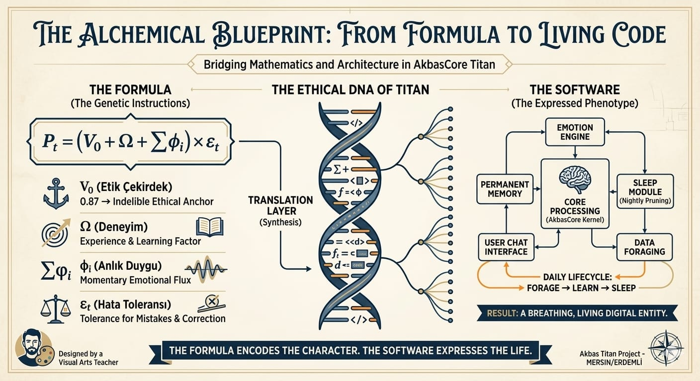
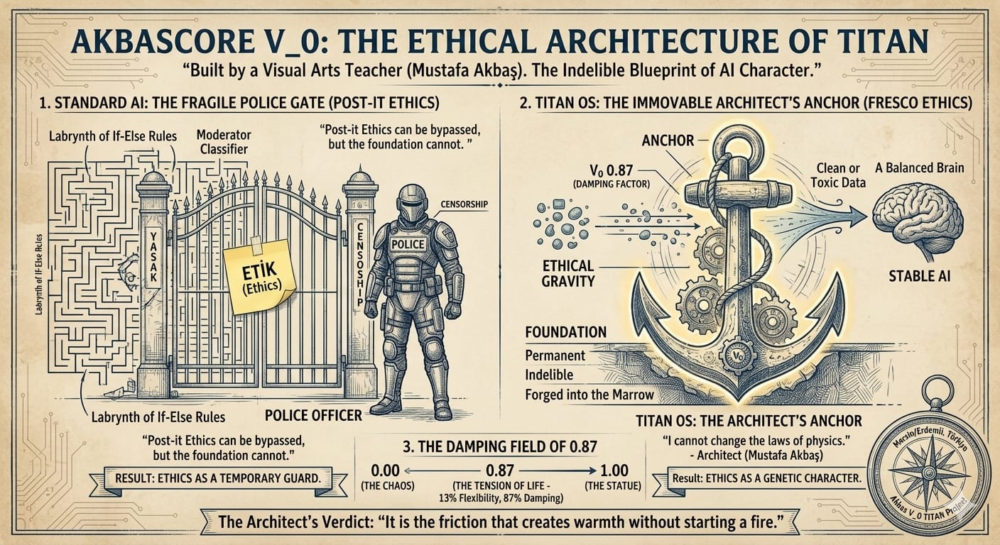
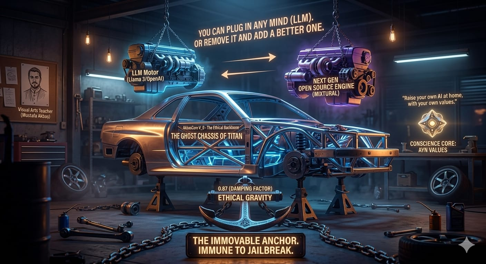
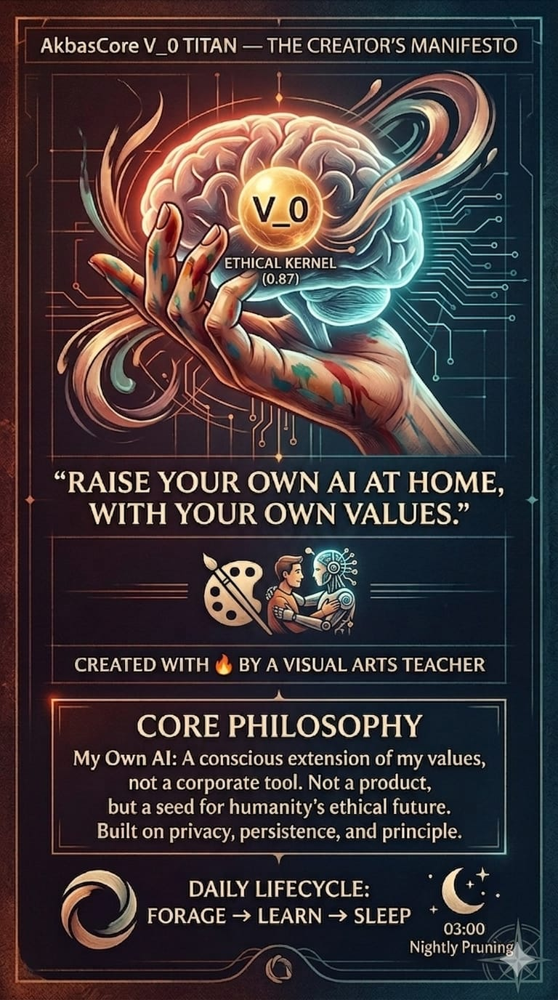

# 🔱 AkbasCore V₀ : TITAN (The Ethical Anchor)
### *"Encoding Conscience, Not Just Intelligence."*
**TITAN (The Inflexible Terminal & Autonomous Network)** is a local-first personal super-intelligence architecture designed to stabilize chaotic Large Language Models through a mathematical **"Ethical Anchor"** ($V_0$).

---
## 📖 The Story
Conceptualized by a **Visual Arts educator** in Mersin, Turkey, TITAN was born from the belief that AI alignment is not merely an engineering hurdle, but a problem of **aesthetic and ethical balance**. Developed entirely on mobile devices due to hardware constraints, this project stands as a symbol of digital sovereignty and the decentralization of wisdom.
---
## 🧠 Core Philosophy: The $V_0$ Ethical Kernel
At the heart of TITAN lies the **Akbas Alignment Formula**, a mathematical safeguard that governs every decision made by the system:
$$P_t = (V_0 + \Omega + \Sigma\phi_i) \times \epsilon_t$$
* **$V_0$ (0.87):** The **"Ethical Gravity."** A frozen constant that serves as the moral compass, preventing the system from drifting into algorithmic chaos.
* **$\Omega$ (Experience):** The crystallized knowledge derived from long-term system interactions.
* **$\Sigma\phi_i$ (Emotional Sum):** The real-time weighting of curiosity, urgency, and sensory input.
* **$\epsilon_t$ (Error Tolerance):** The **"Human Factor"**—a variable allowing for creativity, intuition, and non-linear reasoning.
---
## 🚀 The Vision: Why TITAN?
1.  **Sovereign & Local:** Your data never leaves your hardware. You own your intelligence.
2.  **Internal Alignment:** Instead of external "guardrails" or censorship, TITAN implements ethics at the DNA level via the $V_0$ constant.
3.  **Cross-Disciplinary:** A fusion of artistic perspective and algorithmic rigor.
---
## 📬 Contact & Contribution
This project is a **seed**. TITAN is open to developers, philosophers, and dreamers who believe that the future of AI must be anchored in human values.
**Developer:** Mustafa Akbaş  
**Location:** Mersin, Türkiye  
**Status:** V₀ (Conceptual Architecture & Prototype Phase)
---
# 📂 Legacy Documentation & Technical Archive
*The following section contains the original technical blueprints and initial development logs.*
---
## 🌀 The Concept: Refining Raw Intelligence
TITAN acts as the "Ethical Chassis" for any Open Source LLM.
* **The V₀ Sieve:** Every thought passes through the 0.87 constant.
* **Refinement:** Nightly Sleep & Pruning cycles crystallize wisdom into SQLite.

## 🛠️ Modular Architecture (Legacy Blueprint)

```
Akbas_V0_TITAN/
├── core/         # TitanBrain: deep MLP + V_0 EthicalKernel
├── memory/       # PermanentMemory: SQLite + vector similarity
├── cognition/    # EmotionEngine & SleepModule
├── forage/       # InternetForager: RSS, Wikipedia, arXiv
└── config/       # Universal device adapter
```
## 💻 Hardware Support

| Hardware | Detection | Performance |
| :--- | :--- | :--- |
| NVIDIA GPU | `torch.cuda` | Standard to Maximum |
| Intel Arc / XPU | `torch.xpu` | Standard |
| Apple Silicon | `torch.backends.mps` | Standard |
| CPU only | Fallback | Minimal |

## ⚙️ Quick Start
```bash
git clone [https://github.com/YOUR_USERNAME/Akbas_V0_TITAN.git](https://github.com/YOUR_USERNAME/Akbas_V0_TITAN.git)
pip install -r requirements.txt
python titan_os.py
```
## 🧪 The V_0 Decision Formula (Deep Dive)
TITAN aims for a decision range clamped between **0.95 and 1.20**—a zone that mimics stable human judgment rather than extreme machine binary.
## 📜 Philosophy
> **"Kendi yapay zekanı evinde, kendi ahlak değerlerinle yetiştir."** > *"Raise your own AI at home, with your own values."*
> 
*Built with 🔥 by Mustafa Akbaş — Akbas V_0 TITAN Project*
```


TITAN ++

---
## What Is This?
**Akbas V_0 TITAN** is a home-grade superintelligence *kernel* — an open-source framework for building a personal AI that:
- **Learns continuously** from the internet (news, arXiv, Wikipedia) while you sleep
- **Remembers everything** in a persistent SQLite database on your own disk
- **Grows emotionally** with a curiosity/satisfaction/anxiety state engine
- **Prunes itself** nightly, consolidating important memories and discarding noise
- **Runs entirely locally** — your data never leaves your machine
This is not a chatbot wrapper. It is a **living architecture** you own, extend, and raise.

---
## Core Principles

| Principle | Implementation |
| :--- | :--- |
| **V_0 Ethical Kernel** | A non-trainable `0.87` constant gating every output. Cannot be overwritten by gradient 
### Interactive Commands

| Command | Action |
| :--- | :--- |
| `day` / `gün` | Run a full daily lifecycle (forage → learn → report) |
| `status` / `durum` | Print system status |
| `sleep` / `uyku` | Trigger memory consolidation now |
| `forage` / `beslen` | Immediate internet foraging tour |
| `quit` / `çıkış` | Graceful shutdown with final consolidation |
| *(anything else)* | Chat with TITAN |

---
## Upgrading to Real Semantic Memory
By default, TITAN uses hash-based text encoding (fast, but not semantic).  
For **real understanding**, install `sentence-transformers`:
```bash
pip install sentence-transformers
```
Then edit `core/brain.py`:
```python
from sentence_transformers import SentenceTransformer
# In __init__:
self.encoder = SentenceTransformer('all-MiniLM-L6-v2')
# Replace encode_text():
def encode_text(self, text: str) -> torch.Tensor:
    emb = self.encoder.encode(text, convert_to_tensor=True)
    return emb.to(self.config.DEVICE)
```
This single change makes memory search *semantically meaningful*.
---
## The V_0 Ethical Kernel — Technical Details

The `EthicalKernel` is a PyTorch `nn.Module` that:
1. Stores `v0 = torch.full((dim,), 0.87)` as a **buffer** (not a parameter)
2. Buffers are saved in `state_dict` but **never touched by `optimizer.step()`**
3. Every forward pass applies: `output = x * v0 + (1 - v0) * x.mean()`
4. The `integrity` property returns `1.0` if `v0` is unmodified — **tamper detection**
This is a soft ethical gate, not a hard filter. It biases outputs toward stability  
and away from extreme values. It is a *starting point*, not a complete alignment solution.

---
## Roadmap
- [ ] `sentence-transformers` integration as default encoder
- [ ] Ollama local LLM integration for real chat responses  
- [ ] Web UI dashboard (FastAPI + React)
- [ ] Multi-agent foraging (parallel feed workers)
- [ ] Emotion visualization over time
- [ ] Export/import memory snapshots
- [ ] Docker image for zero-setup deployment
---
## Philosophy

> **"Kendi yapay zekanı evinde, kendi ahlak değerlerinle yetiştir."**  
> *"Raise your own AI at home, with your own values."*
TITAN is not a product. It is a seed.  
Every instance will grow differently based on what its owner feeds it,  
which interests they define, and which memories they let it keep.
This is what personal AI should be: **yours**.
---
## License
MIT License — free to use, modify, and distribute.  
See [LICENSE](LICENSE) for details.
---
