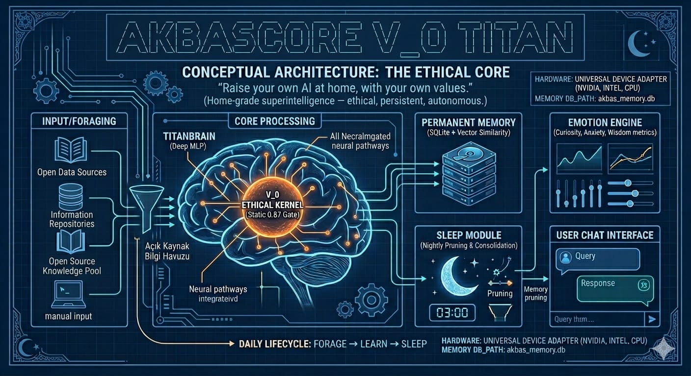

# 🔮 Akbas V_0 TITAN — The Ethical Core

> *"Donmuş bir model değil, sizinle büyüyen bir bilinç çekirdeği."*  
> *"Not a frozen model — a consciousness that grows with you."*

[](LICENSE)
[](https://www.python.org/)
[](https://pytorch.org/)
[]()

---

## What Is This?

**Akbas V_0 TITAN** is a home-grade superintelligence *kernel* — an open-source framework for building a personal AI that:

- **Learns continuously** from the internet (news, arXiv, Wikipedia) while you sleep
- **Remembers everything** in a persistent SQLite database on your own disk
- **Grows emotionally** with a curiosity/satisfaction/anxiety state engine
- **Prunes itself** nightly, consolidating important memories and discarding noise
- **Runs entirely locally** — your data never leaves your machine

This is not a chatbot wrapper. It is a **living architecture** you own, extend, and raise.


---

## Core Principles

| Principle | Implementation |
|-----------|----------------|
| **V_0 Ethical Kernel** | A non-trainable `0.87` constant gating every output. Cannot be overwritten by gradient descent. |
| **Persistent Evolution** | SQLite memory survives reboots. Importance-weighted recall. Cosine similarity search. |
| **Autonomic Foraging** | RSS + Wikipedia + arXiv feeds. Scored by relevance to your interests. |
| **Sleep & Pruning** | Nightly consolidation at 03:00. Weak memories pruned. Important ones strengthened. |
| **Privacy First** | Zero cloud dependency. All compute on your GPU. All data on your SSD. |

---

## Architecture



```
Akbas_V0_TITAN/
├── core/
│   └── brain.py          # TitanBrain: deep MLP + V_0 EthicalKernel
├── memory/
│   └── store.py          # PermanentMemory: SQLite + vector similarity
├── cognition/
│   ├── emotion.py        # EmotionEngine: curiosity / anxiety / wisdom
│   └── sleep.py          # SleepModule: nightly consolidation + dream replay
├── forage/
│   └── internet.py       # InternetForager: RSS, Wikipedia, arXiv
├── config/
│   └── hardware.py       # Universal device adapter (NVIDIA / Intel / CPU)
├── akbas_memory.db       # Your living memory (auto-created)
├── requirements.txt
└── titan_os.py           # Main entry point
```


---

## Hardware Support

TITAN auto-detects and adapts to any hardware:

| Hardware | Detection | Performance |
|----------|-----------|-------------|
| NVIDIA GPU (single) | `torch.cuda.is_available()` | Standard (512→2048→512) |
| NVIDIA GPU (4×) | `GPU_COUNT >= 4` | Large (1024→4096→1024) |
| NVIDIA GPU (8×) | `GPU_COUNT >= 8` | Maximum (2048→8192→2048) |
| Intel Arc / XPU | `torch.xpu.is_available()` | Standard |
| Apple Silicon (M1/M2) | `torch.backends.mps` | Standard |
| CPU only | Fallback | Minimal (256→512→256) |

---

## Quick Start

```bash
# 1. Clone
git clone https://github.com/YOUR_USERNAME/Akbas_V0_TITAN.git
cd Akbas_V0_TITAN

# 2. Install
pip install -r requirements.txt

# 3. Run
python titan_os.py
```

### Interactive Commands

| Command | Action |
|---------|--------|
| `day` / `gün` | Run a full daily lifecycle (forage → learn → report) |
| `status` / `durum` | Print system status |
| `sleep` / `uyku` | Trigger memory consolidation now |
| `forage` / `beslen` | Immediate internet foraging tour |
| `quit` / `çıkış` | Graceful shutdown with final consolidation |
| *(anything else)* | Chat with TITAN |

---

## Upgrading to Real Semantic Memory

By default, TITAN uses hash-based text encoding (fast, but not semantic).  
For **real understanding**, install `sentence-transformers`:

```bash
pip install sentence-transformers
```

Then edit `core/brain.py`:

```python
from sentence_transformers import SentenceTransformer

# In __init__:
self.encoder = SentenceTransformer('all-MiniLM-L6-v2')

# Replace encode_text():
def encode_text(self, text: str) -> torch.Tensor:
    emb = self.encoder.encode(text, convert_to_tensor=True)
    return emb.to(self.config.DEVICE)
```

This single change makes memory search *semantically meaningful*.

---

## The V_0 Ethical Kernel — Technical Details


The `EthicalKernel` is a PyTorch `nn.Module` that:

1. Stores `v0 = torch.full((dim,), 0.87)` as a **buffer** (not a parameter)
2. Buffers are saved in `state_dict` but **never touched by `optimizer.step()`**
3. Every forward pass applies: `output = x * v0 + (1 - v0) * x.mean()`
4. The `integrity` property returns `1.0` if `v0` is unmodified — **tamper detection**

This is a soft ethical gate, not a hard filter. It biases outputs toward stability  
and away from extreme values. It is a *starting point*, not a complete alignment solution.


---

## Roadmap

- [ ] `sentence-transformers` integration as default encoder
- [ ] Ollama local LLM integration for real chat responses  
- [ ] Web UI dashboard (FastAPI + React)
- [ ] Multi-agent foraging (parallel feed workers)
- [ ] Emotion visualization over time
- [ ] Export/import memory snapshots
- [ ] Docker image for zero-setup deployment

---

## Philosophy


> **"Kendi yapay zekanı evinde, kendi ahlak değerlerinle yetiştir."**  
> *"Raise your own AI at home, with your own values."*

TITAN is not a product. It is a seed.  
Every instance will grow differently based on what its owner feeds it,  
which interests they define, and which memories they let it keep.

This is what personal AI should be: **yours**.

---

## License

MIT License — free to use, modify, and distribute.  
See [LICENSE](LICENSE) for details.

---

*Built with 🔥 by Mustafa Akbaş — Akbas V_0 TITAN Project*
