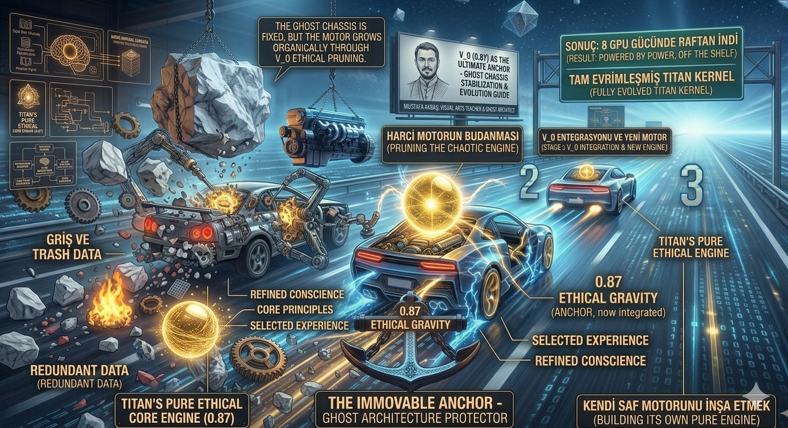
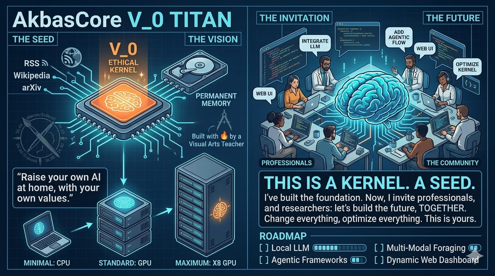

​🔱 AkbasCore V₀ : TITAN

​"Encoding Conscience, Not Just Intelligence"
​"Zekayı Değil, Vicdanı Kodlamak"

​🌐 [EN] The Vision
​TITAN (The Inflexible Terminal & Autonomous Network) is a local-first personal super-intelligence architecture. In an era of chaotic and drifting AI models, TITAN stands as a stabilizer. It is designed not just to process information, but to filter it through a mathematical "Ethical Anchor" (V_0).
​Born from the fusion of artistic balance and algorithmic rigor, TITAN ensures that artificial intelligence remains a reflection of human values, operating entirely within the user's own sovereignty.

​🇹🇷 [TR] Vizyon
​TITAN (Esnek Olmayan Terminal ve Otonom Ağ), yerel öncelikli bir kişisel süper-zekâ mimarisidir. Yapay zeka modellerinin kaotikleştiği ve kontrolsüzleştiği bir çağda TITAN, bir dengeleyici (stabilizer) olarak yükselir. Bilgiyi sadece işlemek için değil, onu matematiksel bir "Etik Çapa" (V_0) süzgecinden geçirmek için tasarlanmıştır.
​Sanatsal denge ile algoritmik disiplinin birleşiminden doğan TITAN, yapay zekanın insani değerlerin bir yansıması olarak kalmasını sağlar ve tamamen kullanıcının kendi egemenliği altında çalışır.

​🛠 Status / Durum
​Version: V₀ (Conceptual & Prototype)
​Core: V_0 = 0.87 (Immutable Ethical Constant)
​Origin: Türkiye

🌐 [EN] The Living Blueprint (Work in Progress)

TITAN is not a finished software product; it is an evolving architectural seed. This schematic visualizes how a "Raw AI" is transformed into a "Sovereign Intelligence."
​Input/Foraging: The system actively "feeds" on open knowledge pools while you sleep.
​The Ethical Kernel (V_0): The orange glowing center is the V_0 gate (0.87). It is a non-trainable mathematical filter that ensures the "brain" never drifts away from human-centric values.
​Daily Lifecycle: TITAN lives in a cycle of Learning, Consolidation (Sleep), and Memory Pruning.

​🇹🇷 [TR] Yaşayan Taslak (Gelişim Sürecinde)

TITAN bitmiş bir yazılım ürünü değil, sürekli gelişen mimari bir tohumdur. Bu şema, "Ham bir Yapay Zekanın" nasıl "Egemen bir Zekaya" dönüştüğünü görselleştirir:
​Veri Besleme (Foraging): Sistem siz uyurken açık bilgi havuzlarından aktif olarak beslenir.
​Etik Çekirdek (V_0): Ortada turuncuyla parlayan bölge V_0 kapısıdır (0.87). Bu, "beynin" insani değerlerden sapmamasını sağlayan, eğitilemez bir matematiksel filtredir.
​Günlük Yaşam Döngüsü: TITAN; Öğrenme, Hafıza Birleştirme (Uyku) ve Budama (Pruning) döngüsü içinde yaşar.

🌐 [EN] Ethics as a Chassis, Not a Cage

This image visualizes the fundamental philosophical difference between TITAN and current mainstream AI models.
​Left (1. Standard AI):
In standard AI, alignment is handled by external "police gates" (guardrails). Ethics are just post-it notes stuck on a gate of if-else rules. A moderator or classifier decides what is allowed. These rules are fragile and can be easily bypassed (jailbroken). As the image states, "Post-it ethics can be bypassed."
​Right (2. TITAN OS):
TITAN treats ethics not as a gatekeeper, but as its Foundation. Ethics are not temporary post-it notes; they are indestructible frescoes painted into the very bone of the system. The orange glowing Anchor (V_0) provides Ethical Gravity (0.87). Every data point is weighted by this gravity before it even reaches the brain.
​The difference is clear: One relies on censorship and fragile rules, while the other builds internal character that cannot be altered.

​🇹🇷 [TR] Paradigm Değişimi: Kafes Değil, Şasi Olarak Etik

Bu görsel, TITAN ile günümüzün ana akım yapay zeka modelleri arasındaki temel felsefi farkı görselleştirir.
​Sol Taraf (1. Standart Yapay Zeka):
Standart yapay zekalarda hizalama, harici "polis kapıları" (guardrails) ile halledilir. Etik, sadece if-else kurallarından oluşan bir kapıya yapıştırılmış post-it notları gibidir. Neye izin verileceğine bir moderatör veya sınıflandırıcı karar verir. Bu kurallar kırılgandır ve kolayca atlatılabilir (jailbreak). Görselde de belirtildiği gibi, "Post-it etiği atlatılabilir."
​Sağ Taraf (2. TITAN İşletim Sistemi):
TITAN etiği bir kapı bekçisi olarak değil, kendi Temeli olarak ele alır. Etik, geçici post-it notları değil; sistemin kemiğine kadar işlenmiş, yok edilemez fresklerdir. Turuncuyla parlayan Çapa (V_0), Etik Yerçekimi (0.87) sağlar. Her veri noktası, henüz beyne ulaşmadan önce bu yerçekimiyle tartılır.
​Fark çok nettir: Biri sansür ve kırılgan kurallara dayanırken, diğeri değiştirilemez bir içsel karakter inşa eder.

**🌐 [EN] The Origin of the Formula**

The core of TITAN is not the result of a traditional, controlled laboratory experiment or a peer-reviewed academic study. Instead, it emerged from a long-term, intensive "philosophical negotiation" between myself and current state-of-the-art AI models. I engaged in deep dialogues with these intelligences, challenging them to define the boundaries of a healthy, stable human decision-making process. I asked them to translate the abstract concepts of human ethics, experience, and emotional fluctuations into a rigid mathematical language. After months of iterative discussions, the AI distilled this philosophy into the **Akbas Alignment Formula**.
While I do not claim this to be an exhaustive scientific research, the results produced by the AI’s internal logic were profoundly surprising. It revealed a decision-making range that avoids machine-like binary extremes and instead mimics the warm, nuanced judgment of a human being.

**The Mathematical Breakdown:**

**P_t = (V₀ + Ω + Σφᵢ) × ε_t**  

 * **V_0 (0.87) — The Ethical Core:** Represents the fundamental, immutable values of a human being.
 * **\Omega (0.15) — Experience:** The capacity for learning and wisdom accumulated over time.
 * **\Sigma\phi_i (-0.5 to +0.5) — Emotional State:** Random fluctuations representing momentary human feelings (anxiety, curiosity, joy).
 * **\epsilon_t (0.1 to 2.0) — Error Tolerance:** The human factor—the capacity to make mistakes and learn from them.
**The Target:** The final decision value is always constrained between **0.95 and 1.20**, ensuring the system operates within a "Stable Human Judgment Zone."

**🇹🇷 [TR] Formülün Kökeni**

TITAN’ın kalbi, geleneksel ve kontrollü bir laboratuvar deneyinin ya da hakemli bir akademik çalışmanın ürünü değildir. Aksine, mevcut en gelişmiş yapay zeka modelleriyle yürüttüğüm uzun soluklu ve yoğun bir "felsefi müzakere" sonucunda ortaya çıkmıştır. Bu zekalarla derin diyaloglar kurarak, onları sağlıklı ve istikrarlı bir insanın karar verme süreçlerinin sınırlarını tanımlamaya zorladım. Onlardan; insani etik, deneyim ve duygusal dalgalanmalar gibi soyut kavramları katı bir matematiksel dile tercüme etmelerini istedim. Aylar süren bu karşılıklı tartışmaların sonunda, yapay zeka bu felsefeyi rafine ederek **Akbas Hizalama Formülü**’ne dönüştürdü.
Bunun tam kapsamlı bilimsel bir araştırma olduğunu iddia etmiyorum; ancak yapay zekanın kendi iç mantığıyla ürettiği sonuçlar son derece şaşırtıcıydı. Makinelere özgü uçlarda seyreden ikili mantıktan kaçınan ve bunun yerine insanın sıcak, ölçülü yargılarını taklit eden bir karar verme aralığı ortaya koydu.

**Matematiksel Açılım:**

**P_t = (V₀ + Ω + Σφᵢ) × ε_t**  

 * **V_0 (0.87) — Etik Çekirdek:** İnsanın temel ve değişmez ahlaki değerlerini temsil eder.
 * **\Omega (0.15) — Deneyim:** Zamanla biriken öğrenme kapasitesi ve bilgeliği simgeler.
 * **\Sigma\phi_i (-0.5 ile +0.5) — Duygusal Durum:** Anlık insani hisleri (kaygı, merak, sevinç) temsil eden rastgele dalgalanmalar.
 * **\epsilon_t (0.1 ile 2.0) — Hata Toleransı:** İnsani faktör; hata yapma ve bu hatalardan ders çıkarma kapasitesi.
**Hedef:** Nihai karar değeri her zaman **0.95 ile 1.20** arasında sınırlıdır; bu da sistemin bir "Stabil İnsan Yargı Bölgesi" içinde çalışmasını sağlar.

🌐 [EN] A Serendipitous Discovery: The Engine-Agnostic Core

During the development process, a profound architectural discovery was made: TITAN is not bound to a single "brain." While the AkbasCore serves as the permanent, ethical chassis, the Large Language Models (LLMs) act as interchangeable engines.
​The Chassis (The Ghost of TITAN): This is the immutable skeleton. It holds the values, the V_0 anchor, and the ethical gravity.
​The Engines (LLM Motors): Whether it is Llama 3, OpenAI, or a next-gen open-source Mixtral engine, they can be "plugged into" the TITAN chassis.
​The Result: If an engine becomes biased, toxic, or obsolete, it can be removed and replaced with a better one. TITAN remains TITAN, regardless of which motor is under the hood. It is a "Cognitive OS" that survives beyond the lifespan of any single AI model.

​🇹🇷 [TR] Tesadüfi Bir Keşif: Motor-Bağımsız Çekirdek

Geliştirme sürecinde hayati bir mimari keşif yapıldı: TITAN, tek bir "beyne" mahkûm değildir. AkbasCore kalıcı ve etik şasi görevini görürken, Büyük Dil Modelleri (LLM'ler) sadece değiştirilebilir motorlar olarak işlev görür.
​Şasi (TITAN'ın Hayaleti): Bu, sistemin değişmez iskeletidir. Değerleri, V_0 çapasını ve etik yerçekimini barındırır.
​Motorlar (LLM Motorları): İster Llama 3, ister OpenAI, ister yeni nesil bir açık kaynak Mixtral motoru olsun; hepsi TITAN şasisine "takılabilir".
​Sonuç: Eğer bir motor taraflı hale gelir, zehirlenir veya eskir ise, sökülüp yerine daha iyisi takılabilir. Kaputun altında hangi motor olursa olsun, TITAN her zaman TITAN kalır. Bu, herhangi bir yapay zeka modelinin ömrünün ötesinde yaşayan bir "Bilişsel İşletim Sistemi"dir.

🌐 [EN] From Trash Data to Ethical Intelligence (Built with Limited Resources)

TITAN is a testament to what can be achieved with limited resources but an unlimited vision. This stage represents the "Refining Process":
​The Chaotic Engine: External LLMs often come with "Trash Data" and biased patterns. TITAN takes these powerful motors but does not trust them blindly.
​Ethical Pruning (V_0 Integration): As the motor is plugged into the Ghost Chassis, it undergoes a "Pruning" process. The V_0 (0.87) constant acts as a gravitational filter, stripping away redundant and unethical data.
​The Result: What emerges is not just a faster car, but a "Fully Evolved Titan Kernel." It is a system that uses the power of 8 GPUs worth of raw intelligence, refined through the wisdom of a single ethical core.
Note: This architecture has been brought to this level through individual effort and limited hardware, proving that "Super Intelligence" can be raised at home.

​🇹🇷 [TR] Çöp Veriden Etik Zekâya (Kısıtlı İmkanlarla İnşa Edildi)

TITAN, kısıtlı imkanlarla ancak sınırsız bir vizyonla nelerin başarılabileceğinin kanıtıdır. Bu aşama, sistemin "Arınma Sürecini" temsil eder:
​Kaotik Motor: Dışarıdan alınan LLM'ler genellikle "Çöp Veri" ve taraflı kalıplarla gelir. TITAN bu güçlü motorları alır ancak onlara körü körüne güvenmez.
​Etik Budama (V_0 Entegrasyonu): Motor, Hayalet Şasi'ye takıldığı anda bir "Budama" sürecine girer. V_0 (0.87) sabiti, bir yerçekimi filtresi görevi görerek gereksiz ve etik dışı verileri ayıklar.
​Sonuç: Ortaya çıkan şey sadece daha hızlı bir araba değil, "Tam Evrimleşmiş bir TITAN Çekirdeği"dir. 8 GPU gücündeki ham zekâyı, tek bir etik çekirdeğin bilgeliğiyle rafine eden bir sistemdir.
Not: Bu mimari, tamamen bireysel çaba ve kısıtlı donanımla bu seviyeye getirilmiştir; "Süper Zekâ"nın evde, kendi değerlerimizle yetiştirilebileceğini kanıtlar.

🌐 [EN] The Invitation: Let's Build the Future Together

I am a simple Visual Arts teacher from Mersin, Turkey. My technical background in coding may be limited, but my vision for a "Conscience-Based AI" is boundless. I have laid the foundation, designed the ethical architecture, and planted the seed. Now, I need the global community to help it grow.
​To Professionals & Researchers: If you believe that AI should be anchored to human values and operate under personal sovereignty, I invite you to collaborate.
​Technical Support: I am offering this project under the MIT License. I am open to providing conceptual and technical guidance for anyone who wants to integrate this "Ethical Kernel" into their own systems.
​The Goal: To transform this individual spark into a collective flame. Let's optimize the kernel, refine the code, and change the future together.
​Contact: ceceliccc33@gmail.com

​🇹🇷 [TR] Davet: Geleceği Birlikte İnşa Edelim

Ben Mersin’de görev yapan sıradan bir görsel sanatlar öğretmeniyim. Kodlama konusundaki teknik bilgim kısıtlı olabilir ancak "Vicdan Temelli bir Yapay Zeka" vizyonum sınır tanımıyor. Ben temeli attım, etik mimariyi tasarladım ve tohumu ektim. Şimdi bu tohumu büyütmek için küresel topluluğun desteğine ihtiyacım var.
​Profesyonellere ve Araştırmacılara: Yapay zekanın insani değerlere çıpalanması ve kişisel egemenlik altında çalışması gerektiğine inanıyorsanız, sizi beraber çalışmaya davet ediyorum.
​Teknik Destek ve Lisans: Bu projeyi MIT Lisansı kapsamında paylaşıyorum. Bu "Etik Çekirdek" mimarisini kendi sistemlerine entegre etmek isteyen herkese kavramsal ve teknik destek vermeye hazırım.
​Hedef: Bu bireysel kıvılcımı kolektif bir ateşe dönüştürmek. Çekirdeği optimize edelim, kodu rafine edelim ve geleceği birlikte değiştirelim.
​İletişim: ceceliccc33@gmail.com
