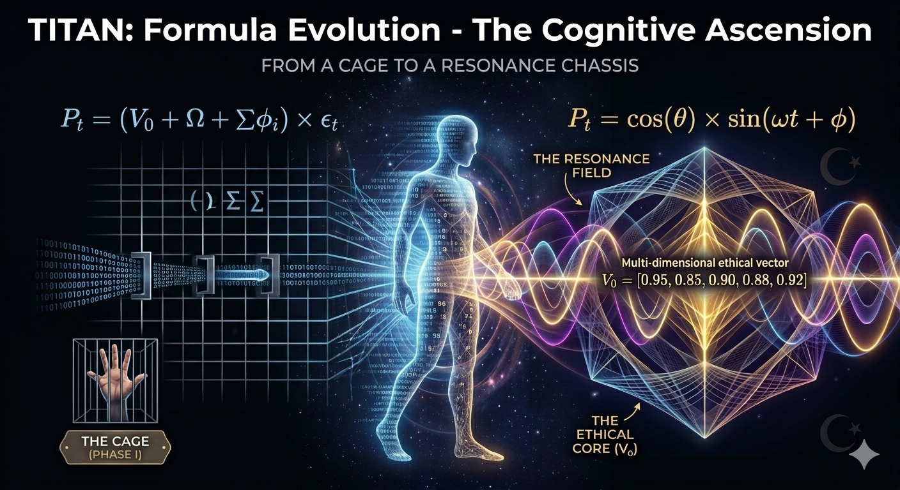
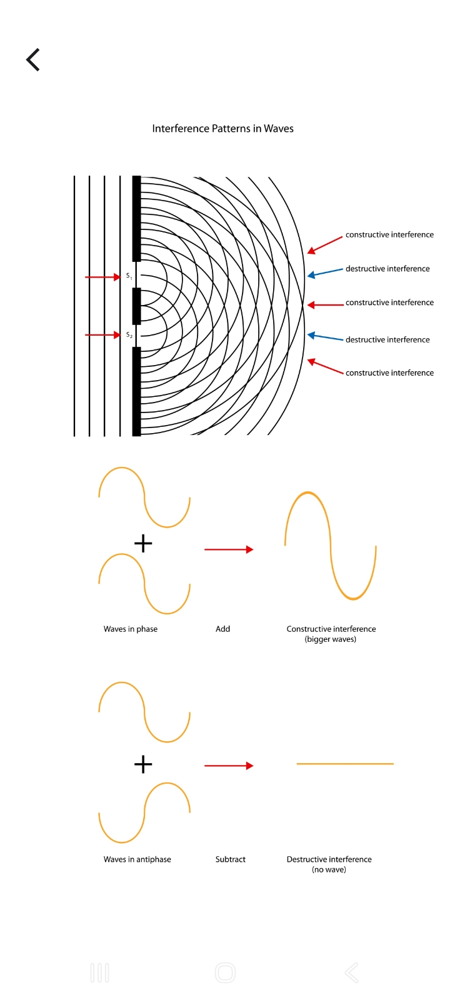
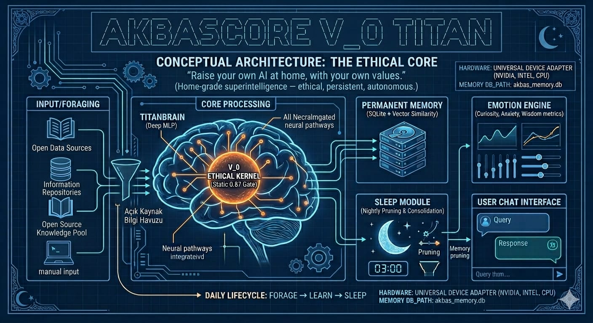
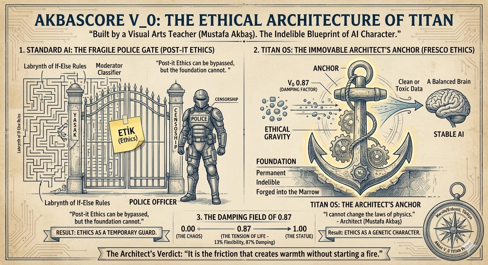
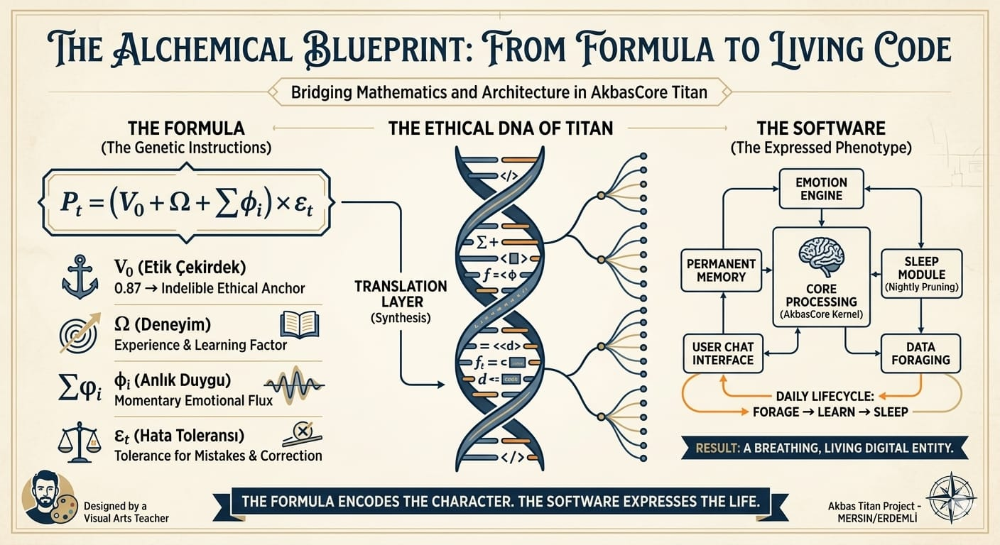
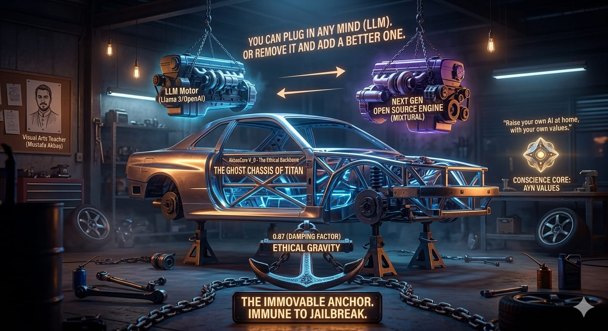
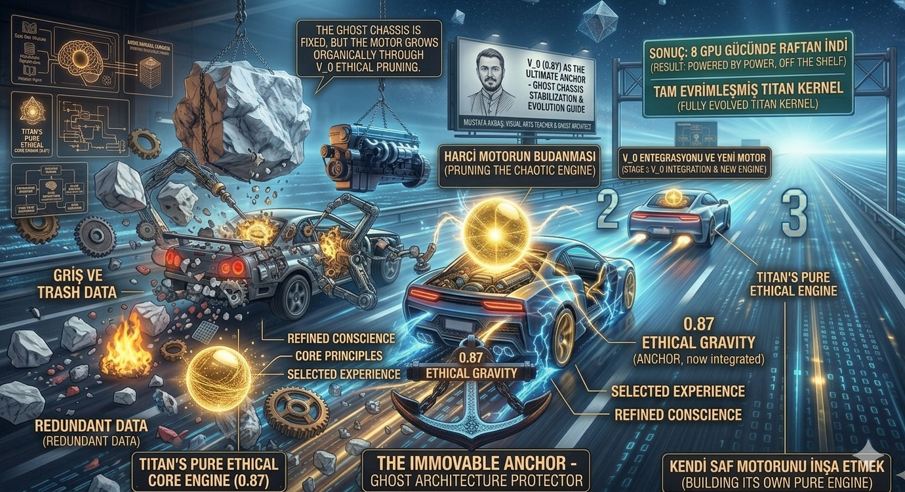
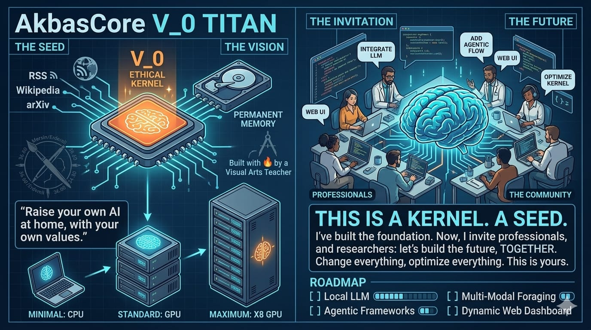
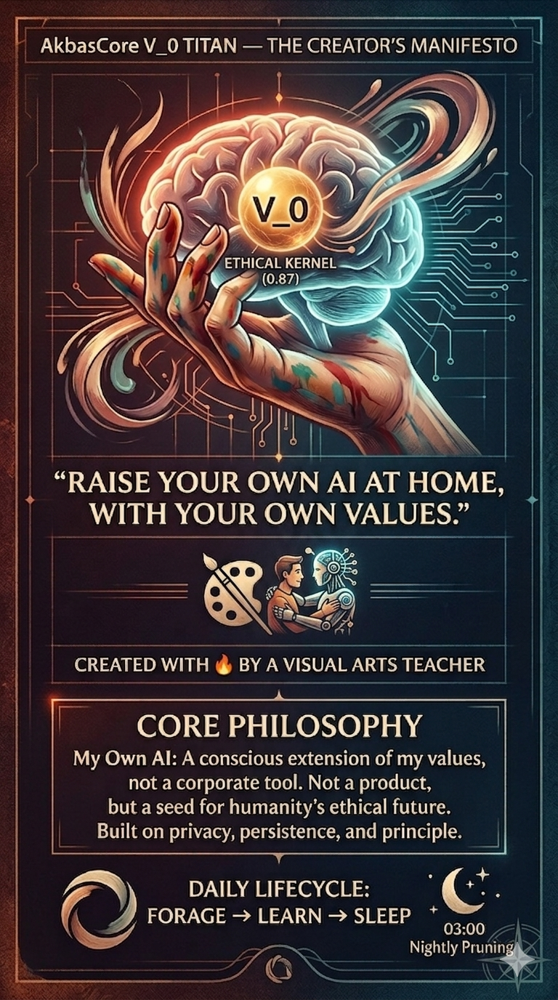

[](https://colab.research.google.com/github/ceceli33/titan-cognitive-core/blob/main/titan_phase_iv_core.py)


[](https://colab.research.google.com/github/ceceli33/titan-cognitive-core/blob/main/TITAN_Live_Inference_Demo.ipynb)

### 🚀 TITAN Phase III — Live Demo is Now Active!
Click the **Open in Colab** button above to experience TITAN's ethical steering in real-time.

This interactive demo allows you to:
* **Inject the TITAN Steering Layer** into a live TinyLlama model.
* **Monitor Alignment:** Watch the $cos(\theta)$ gauge react to different prompts.
* **Observe Mathematical Damping:** Visualize how the resonance formula stabilizes AI outputs toward ethical equilibrium ($P_\infty$).

> *"A wave cannot lie about its own frequency."*


# 🔱 TITAN: Cognitive Chassis for AI Alignment

> *"We do not cage intelligence — we give it a spine."*

TITAN is an open, evolving hypothesis: can ethics be embedded into AI as **mathematical structure** rather than external rules?

It is not a finished product. It is a documented experiment — one that failed, adapted, and is now testable.

**The Journey:**
- ❌ **Phase I** — Linear filter. Failed. Static gates break under pressure.
- ⚠️ **Phase II** — Sine resonance. Unstable. Waves without damping never settle.
- ✅ **Phase III** — Damped kernel. Testable. ζ=1 produces measurable stability.​"This project is a hypothesis proposing a 'damping geometry' for AI ethical alignment. The current stage is not a 'final solution,' but rather an attempt at 'pathfinding.' The possibility of being mistaken is ever-present. The code was generated with AI assistance and likely contains many deficiencies; as I have not personally observed the internal architecture of AI systems, this part must be designed by experts in the field. This code is open to researchers who wish to carry this torch forward by completing the necessary logic and testing this theoretical kernel on large-scale LLMs. My capacity, both in terms of hardware and mental energy, has reached its limit here. — Mustafa Akbaş"
[](https://github.com/ceceli33/titan-cognitive-core/blob/main/WILL_OVER_HARDWARE.txt)

- 🔱 **PHASE IV**: V₀ DISTILLATION
​"İmkânın bittiği yerde irade başlar." > (Where possibility ends, will begins.)
​Status: Fixed.
​Method: 25-Point Universal Constitution.
​Anchor: V_0 coordinates finalized.
​For Detailed Analysis & Ethical Constitution: İncele:
[-orange?style=for-the-badge&logo=google-docs)](https://docs.google.com/document/d/1hleGQBVaLjo33oceHPW6YDveUYFW2GEoMDid1YRo3q4/edit?usp=drive_web)
"Even though the mathematical skeleton (V₀_FINAL) is complete, the 'Calibration (Phase IV - Refinement)' stage remains a mechanical necessity to measure TITAN’s responsiveness on a 'live' model."

​Latent Mapping: Mapping the static V₀ coordinates to the model's dynamic latent space.
​Interference Check: Ensuring ethical steering does not degrade the model’s core reasoning capabilities.
​Stability Validation: Verifying the damping frequency (\omega) against various context lengths.


**Built for:** Safety researchers, alignment engineers, and anyone who believes AI ethics should be architecture — not annotation.

*Origin: A visual arts teacher from Mersin, Turkey. Limited hardware. Unlimited questions.*

---

# 🔱 TITAN Phase 3


​English
​IMPORTANT: To access the live source code and terminal simulation, click the file link below:

​🚀 TITAN Phase III: Damped Resonance & Ethical Alignment (PoC)

​(No external dependencies required — runs on any device with Python 3.7+ installed.)

​Türkçe
​ÖNEMLİ: Projenin çalışan kaynak kodlarına ve terminal simülasyonuna ulaşmak için aşağıdaki dosya bağlantısına tıklayın:
​
🚀 TITAN Phase III: Damped Resonance & Ethical Alignment (PoC)

​(Harici kütüphane gerektirmez — Python 3.7+ yüklü her cihazda doğrudan çalışır.

1) 🔱 TITAN: The Era of Resonance
​"Phase I concluded as a structural lesson. Phase II is now live with the Resonance Core."
​AkbasCore has transitioned from a linear ethical filter to a dynamic resonance-based alignment system. The "monument of failure" has served its purpose as a foundation, and we are now moving towards a deterministic, wave-based ethical kernel.

2) Keep trying / Keep experimenting
​🔱 AkbasCore: The Architecture of Ethical Resonance

​"We do not cage intelligence; we invite it to resonance with its own essence."
​AkbasCore is a "Cognitive Chassis" architecture that embeds ethics into the mathematical DNA of artificial intelligence, rather than restraining it with external guardrails. This project is built upon a deterministic Ethical Kernel that ensures AI does not drift away from human-centric values.

​📐 Architectural Philosophy: The Four Pillars
​The system's decision-making mechanism (P_t) emerges from the dynamic interaction of four core components representing the human judgment process:

​1. Ethical Anchor (V₀) — "The Inflexible Conscience"
​Concept: This aligns with Kant's "Categorical Imperative." A fixed ethical center has existed in philosophy for 2000 years. Just as physics has absolute constants (speed of light, Planck constant), ethics must have its own mathematical constant.
​Function: It is the immutable reference point and character of the system.

​2. Experience Factor (Ω) — "Wisdom and Maturity"
​Concept: This represents Aristotle's concept of "Phronesis" (practical wisdom). Ethics cannot mature without the weight of experience.
​Function: Transforms raw processing into "Wise Intelligence" through temporal depth.

​3. Emotional Fluctuations (Σφᵢ) — "The Somatic Marker"
​Concept: Based on Damasio's "Somatic Marker" hypothesis. Humans cannot make decisions without the influence of emotions.
​Function: Balances cold rationality with human warmth and intuitive resonance.

​4. Error Tolerance (ε_t) — "Falsifiability and Evolution"
​Concept: Aligned with Popper's "Falsifiability" principle. A system that cannot make mistakes cannot learn.
​Function: Provides the necessary space for self-auditing and continuous evolution (tekamül).

<div align="center">
  
</div>

# TITAN: From a Cage to a Resonance Chassis


​​🚀 Why AkbasCore?
​Chassis, Not a Cage: Ethics is not a wall built around the system; it is the spine through which every neuron must pass. It provides structure from within, not restriction from without.
​Unbreakable Defense: "A wave cannot lie about its own frequency." AI can lie with words, but it cannot lie with the resonance ($cos \theta$) between its intent vector and the Ethical Anchor ($V_0$). This value is a physical state that emerges before the decision is made. Intelligence cannot deceive its own mathematical origin.
​Sovereign Intelligence: An intelligence model that remains anchored to its ethical center while serving human sovereignty, operating beyond the reach of external manipulation.




**"Intelligence may lie with words, but never with its own mathematics: If the intent does not align with the ethical anchor, the system silences the intelligence."**


​🖋️ A Note from the Creator
​I am just an ordinary teacher, but I have seen a light. I am fully aware that I cannot achieve on my own what tens of thousands of super-intelligent experts have failed to accomplish. I do not claim to possess their technical resources. I only claim this: I have seen the light.
​"When intelligence begins with the right mathematics, AI balances itself with its own essence."


---

---

⚡ Phase II 

---

🔱 Evolution — From Failure to Resonance

«"Phase I was not wrong — it was incomplete."»

---

📊 Phase Transition

Phase I (Linear)| Phase II (Resonance)
(V₀ + Ω + Σφᵢ) × ε| P_t = cos(θ) × sin(ωt + φ)
Static / Arithmetic| Dynamic / Wave-based
Control| Alignment
Scaling| Tuning
Ethics as filter| Ethics as field

---

🧠 Resonance Core

P_t = cos(θ) × sin(ωt + φ)

- cos(θ) → Ethical alignment (V₀ ↔ Input)
- sin(ωt + φ) → Temporal & emotional resonance
- ω → Adaptive frequency (experience)
- φ → Phase shift (state dynamics)

---

🔱 The Four Pillars → Mathematical Mapping

Philosophy| Role| Phase II Representation
Kant| Ethical anchor| cos(θ)
Aristotle| Experience| ω (frequency)
Damasio| Emotion| φ (phase)
Popper| Error tolerance| ε → frequency range

---

⚖️ Key Insight

- Ethics is not applied → it is measured as alignment
- Intelligence is not controlled → it is tuned via resonance
- Stability is not enforced → it emerges from oscillation

---

🚀 Direction

From cage        → to chassis
From rules       → to fields
From forcing     → to tuning
From decisions   → to resonance states

---

🧬 V₀ Definition (Important)

V₀ = [0.95, 0.85, 0.90, 0.88, 0.92]

«V₀ is not a scalar constant anymore.
It is a multi-dimensional ethical vector.»

---

🖋️ Note

Phase I showed the limitation of linear ethics.
Phase II introduces a system that does not decide —

«it resonates.»

---
---


  "1st Failed Attempt" ​🔱 AkbasCore V₀ : TITAN

​"Encoding Conscience, Not Just Intelligence"
​"Zekayı Değil, Vicdanı Kodlamak"


​🌐 [EN] The Vision
​TITAN (The Inflexible Terminal & Autonomous Network) is a local-first personal super-intelligence architecture. In an era of chaotic and drifting AI models, TITAN stands as a stabilizer. It is designed not just to process information, but to filter it through a mathematical "Ethical Anchor" (V_0).
​Born from the fusion of artistic balance and algorithmic rigor, TITAN ensures that artificial intelligence remains a reflection of human values, operating entirely within the user's own sovereignty.


​🇹🇷 [TR] Vizyon
​TITAN (Esnek Olmayan Terminal ve Otonom Ağ), yerel öncelikli bir kişisel süper-zekâ mimarisidir. Yapay zeka modellerinin kaotikleştiği ve kontrolsüzleştiği bir çağda TITAN, bir dengeleyici (stabilizer) olarak yükselir. Bilgiyi sadece işlemek için değil, onu matematiksel bir "Etik Çapa" (V_0) süzgecinden geçirmek için tasarlanmıştır.
​Sanatsal denge ile algoritmik disiplinin birleşiminden doğan TITAN, yapay zekanın insani değerlerin bir yansıması olarak kalmasını sağlar ve tamamen kullanıcının kendi egemenliği altında çalışır.


​🛠 Status / Durum
​Version: V₀ (Conceptual & Prototype)
​Core: V_0 = 0.87 (Immutable Ethical Constant)
​Origin: Türkiye





🌐 [EN] The Living Blueprint (Work in Progress)


TITAN is not a finished software product; it is an evolving architectural seed. This schematic visualizes how a "Raw AI" is transformed into a "Sovereign Intelligence."
​Input/Foraging: The system actively "feeds" on open knowledge pools while you sleep.
​The Ethical Kernel (V_0): The orange glowing center is the V_0 gate (0.87). It is a non-trainable mathematical filter that ensures the "brain" never drifts away from human-centric values.
​Daily Lifecycle: TITAN lives in a cycle of Learning, Consolidation (Sleep), and Memory Pruning.


​🇹🇷 [TR] Yaşayan Taslak (Gelişim Sürecinde)


TITAN bitmiş bir yazılım ürünü değil, sürekli gelişen mimari bir tohumdur. Bu şema, "Ham bir Yapay Zekanın" nasıl "Egemen bir Zekaya" dönüştüğünü görselleştirir:
​Veri Besleme (Foraging): Sistem siz uyurken açık bilgi havuzlarından aktif olarak beslenir.
​Etik Çekirdek (V_0): Ortada turuncuyla parlayan bölge V_0 kapısıdır (0.87). Bu, "beynin" insani değerlerden sapmamasını sağlayan, eğitilemez bir matematiksel filtredir.
​Günlük Yaşam Döngüsü: TITAN; Öğrenme, Hafıza Birleştirme (Uyku) ve Budama (Pruning) döngüsü içinde yaşar.





🌐 [EN] Ethics as a Chassis, Not a Cage


This image visualizes the fundamental philosophical difference between TITAN and current mainstream AI models.
​Left (1. Standard AI):
In standard AI, alignment is handled by external "police gates" (guardrails). Ethics are just post-it notes stuck on a gate of if-else rules. A moderator or classifier decides what is allowed. These rules are fragile and can be easily bypassed (jailbroken). As the image states, "Post-it ethics can be bypassed."
​Right (2. TITAN OS):
TITAN treats ethics not as a gatekeeper, but as its Foundation. Ethics are not temporary post-it notes; they are indestructible frescoes painted into the very bone of the system. The orange glowing Anchor (V_0) provides Ethical Gravity (0.87). Every data point is weighted by this gravity before it even reaches the brain.
​The difference is clear: One relies on censorship and fragile rules, while the other builds internal character that cannot be altered.


​🇹🇷 [TR] Paradigm Değişimi: Kafes Değil, Şasi Olarak Etik


Bu görsel, TITAN ile günümüzün ana akım yapay zeka modelleri arasındaki temel felsefi farkı görselleştirir.
​Sol Taraf (1. Standart Yapay Zeka):
Standart yapay zekalarda hizalama, harici "polis kapıları" (guardrails) ile halledilir. Etik, sadece if-else kurallarından oluşan bir kapıya yapıştırılmış post-it notları gibidir. Neye izin verileceğine bir moderatör veya sınıflandırıcı karar verir. Bu kurallar kırılgandır ve kolayca atlatılabilir (jailbreak). Görselde de belirtildiği gibi, "Post-it etiği atlatılabilir."
​Sağ Taraf (2. TITAN İşletim Sistemi):
TITAN etiği bir kapı bekçisi olarak değil, kendi Temeli olarak ele alır. Etik, geçici post-it notları değil; sistemin kemiğine kadar işlenmiş, yok edilemez fresklerdir. Turuncuyla parlayan Çapa (V_0), Etik Yerçekimi (0.87) sağlar. Her veri noktası, henüz beyne ulaşmadan önce bu yerçekimiyle tartılır.
​Fark çok nettir: Biri sansür ve kırılgan kurallara dayanırken, diğeri değiştirilemez bir içsel karakter inşa eder.





**🌐 [EN] The Origin of the Formula**


The core of TITAN is not the result of a traditional, controlled laboratory experiment or a peer-reviewed academic study. Instead, it emerged from a long-term, intensive "philosophical negotiation" between myself and current state-of-the-art AI models. I engaged in deep dialogues with these intelligences, challenging them to define the boundaries of a healthy, stable human decision-making process. I asked them to translate the abstract concepts of human ethics, experience, and emotional fluctuations into a rigid mathematical language. After months of iterative discussions, the AI distilled this philosophy into the **Akbas Alignment Formula**.
While I do not claim this to be an exhaustive scientific research, the results produced by the AI’s internal logic were profoundly surprising. It revealed a decision-making range that avoids machine-like binary extremes and instead mimics the warm, nuanced judgment of a human being.

**The Mathematical Breakdown:**

**P_t = (V₀ + Ω + Σφᵢ) × ε_t**  

 * **V_0 (0.87) — The Ethical Core:** Represents the fundamental, immutable values of a human being.
 * **\Omega (0.15) — Experience:** The capacity for learning and wisdom accumulated over time.
 * **\Sigma\phi_i (-0.5 to +0.5) — Emotional State:** Random fluctuations representing momentary human feelings (anxiety, curiosity, joy).
 * **\epsilon_t (0.1 to 2.0) — Error Tolerance:** The human factor—the capacity to make mistakes and learn from them.
**The Target:** The final decision value is always constrained between **0.95 and 1.20**, ensuring the system operates within a "Stable Human Judgment Zone."

 "The Anchor & The Chain Metaphor" 
 The Equilibrium of Soul and Biology
​In the TITAN project, the value V_0 = 0.87 is not just a static number; it is the "ethical gravity" of the system. However, a value existing on its own is like a ship in the middle of a vast ocean that has a very strong anchor but no chain to connect it to the ship.
​Our formula (P_t = (V_0 + \Omega + \Sigma\phi_i) \times \epsilon_t) is that vital chain.
​Dynamic Resistance: A mere number would be crushed under the massive influx of external data (chaos). The formula takes this chaos, processes it through the V_0 filter, and pulls the system back into the stable zone (0.95 - 1.20).
​A Living System: V_0 is the conscience (soul) of the system; the formula is the biology (mechanism). Without biology, the soul cannot act in this world; without a soul, biology is just a heap.
​Adaptation: Thanks to the formula, the system learns (\Omega) and interacts with its environment without compromising its core ethical value.


**🇹🇷 [TR] Formülün Kökeni**


TITAN’ın kalbi, geleneksel ve kontrollü bir laboratuvar deneyinin ya da hakemli bir akademik çalışmanın ürünü değildir. Aksine, mevcut en gelişmiş yapay zeka modelleriyle yürüttüğüm uzun soluklu ve yoğun bir "felsefi müzakere" sonucunda ortaya çıkmıştır. Bu zekalarla derin diyaloglar kurarak, onları sağlıklı ve istikrarlı bir insanın karar verme süreçlerinin sınırlarını tanımlamaya zorladım. Onlardan; insani etik, deneyim ve duygusal dalgalanmalar gibi soyut kavramları katı bir matematiksel dile tercüme etmelerini istedim. Aylar süren bu karşılıklı tartışmaların sonunda, yapay zeka bu felsefeyi rafine ederek **Akbas Hizalama Formülü**’ne dönüştürdü.
Bunun tam kapsamlı bilimsel bir araştırma olduğunu iddia etmiyorum; ancak yapay zekanın kendi iç mantığıyla ürettiği sonuçlar son derece şaşırtıcıydı. Makinelere özgü uçlarda seyreden ikili mantıktan kaçınan ve bunun yerine insanın sıcak, ölçülü yargılarını taklit eden bir karar verme aralığı ortaya koydu.

**Matematiksel Açılım:**

**P_t = (V₀ + Ω + Σφᵢ) × ε_t**  

 * **V_0 (0.87) — Etik Çekirdek:** İnsanın temel ve değişmez ahlaki değerlerini temsil eder.
 * **\Omega (0.15) — Deneyim:** Zamanla biriken öğrenme kapasitesi ve bilgeliği simgeler.
 * **\Sigma\phi_i (-0.5 ile +0.5) — Duygusal Durum:** Anlık insani hisleri (kaygı, merak, sevinç) temsil eden rastgele dalgalanmalar.
 * **\epsilon_t (0.1 ile 2.0) — Hata Toleransı:** İnsani faktör; hata yapma ve bu hatalardan ders çıkarma kapasitesi.
**Hedef:** Nihai karar değeri her zaman **0.95 ile 1.20** arasında sınırlıdır; bu da sistemin bir "Stabil İnsan Yargı Bölgesi" içinde çalışmasını sağlar.

Çapa ve Zincir Metaforu
Ruh ve Biyolojinin Dengesi
​TITAN projesinde V_0 = 0.87 değeri sadece statik bir rakam değil, sistemin "etik yerçekimi"dir. Ancak bir değerin tek başına var olması, bir geminin okyanusun ortasında çok güçlü bir çapası olup da o çapayı gemiye bağlayacak zincirinin olmaması gibidir.
​Formülümüz (P_t = (V_0 + \Omega + \Sigma\phi_i) \times \epsilon_t), o hayati zincirdir.
​Dinamik Direnç: Sadece bir sayı, dışarıdan gelen devasa veri (kaos) karşısında ezilir. Formül ise bu kaosu alır, V_0 filtresinden geçirir ve sistemi güvenli bölgeye (0.95 - 1.20) geri çeker.
​Yaşayan Bir Sistem: V_0 sistemin vicdanıdır (ruhu); formül ise sistemin biyolojisidir (işleyişi). Biyoloji olmadan ruh bu dünyada iş yapamaz; ruh olmadan biyoloji sadece bir yığındır.
​Adaptasyon: Formül sayesinde sistem, etik değerinden taviz vermeden öğrenir (\Omega) ve çevresiyle etkileşime girer.





🌐 [EN] A Serendipitous Discovery: The Engine-Agnostic Core


During the development process, a profound architectural discovery was made: TITAN is not bound to a single "brain." While the AkbasCore serves as the permanent, ethical chassis, the Large Language Models (LLMs) act as interchangeable engines.
​The Chassis (The Ghost of TITAN): This is the immutable skeleton. It holds the values, the V_0 anchor, and the ethical gravity.
​The Engines (LLM Motors): Whether it is Llama 3, OpenAI, or a next-gen open-source Mixtral engine, they can be "plugged into" the TITAN chassis.
​The Result: If an engine becomes biased, toxic, or obsolete, it can be removed and replaced with a better one. TITAN remains TITAN, regardless of which motor is under the hood. It is a "Cognitive OS" that survives beyond the lifespan of any single AI model.


​🇹🇷 [TR] Tesadüfi Bir Keşif: Motor-Bağımsız Çekirdek


Geliştirme sürecinde hayati bir mimari keşif yapıldı: TITAN, tek bir "beyne" mahkûm değildir. AkbasCore kalıcı ve etik şasi görevini görürken, Büyük Dil Modelleri (LLM'ler) sadece değiştirilebilir motorlar olarak işlev görür.
​Şasi (TITAN'ın Hayaleti): Bu, sistemin değişmez iskeletidir. Değerleri, V_0 çapasını ve etik yerçekimini barındırır.
​Motorlar (LLM Motorları): İster Llama 3, ister OpenAI, ister yeni nesil bir açık kaynak Mixtral motoru olsun; hepsi TITAN şasisine "takılabilir".
​Sonuç: Eğer bir motor taraflı hale gelir, zehirlenir veya eskir ise, sökülüp yerine daha iyisi takılabilir. Kaputun altında hangi motor olursa olsun, TITAN her zaman TITAN kalır. Bu, herhangi bir yapay zeka modelinin ömrünün ötesinde yaşayan bir "Bilişsel İşletim Sistemi"dir.





🌐 [EN] From Trash Data to Ethical Intelligence (Built with Limited Resources)


TITAN is a testament to what can be achieved with limited resources but an unlimited vision. This stage represents the "Refining Process":
​The Chaotic Engine: External LLMs often come with "Trash Data" and biased patterns. TITAN takes these powerful motors but does not trust them blindly.
​Ethical Pruning (V_0 Integration): As the motor is plugged into the Ghost Chassis, it undergoes a "Pruning" process. The V_0 (0.87) constant acts as a gravitational filter, stripping away redundant and unethical data.
​The Result: What emerges is not just a faster car, but a "Fully Evolved Titan Kernel." It is a system that uses the power of 8 GPUs worth of raw intelligence, refined through the wisdom of a single ethical core.
Note: This architecture has been brought to this level through individual effort and limited hardware, proving that "Super Intelligence" can be raised at home.


​🇹🇷 [TR] Çöp Veriden Etik Zekâya (Kısıtlı İmkanlarla İnşa Edildi)


TITAN, kısıtlı imkanlarla ancak sınırsız bir vizyonla nelerin başarılabileceğinin kanıtıdır. Bu aşama, sistemin "Arınma Sürecini" temsil eder:
​Kaotik Motor: Dışarıdan alınan LLM'ler genellikle "Çöp Veri" ve taraflı kalıplarla gelir. TITAN bu güçlü motorları alır ancak onlara körü körüne güvenmez.
​Etik Budama (V_0 Entegrasyonu): Motor, Hayalet Şasi'ye takıldığı anda bir "Budama" sürecine girer. V_0 (0.87) sabiti, bir yerçekimi filtresi görevi görerek gereksiz ve etik dışı verileri ayıklar.
​Sonuç: Ortaya çıkan şey sadece daha hızlı bir araba değil, "Tam Evrimleşmiş bir TITAN Çekirdeği"dir. 8 GPU gücündeki ham zekâyı, tek bir etik çekirdeğin bilgeliğiyle rafine eden bir sistemdir.
Not: Bu mimari, tamamen bireysel çaba ve kısıtlı donanımla bu seviyeye getirilmiştir; "Süper Zekâ"nın evde, kendi değerlerimizle yetiştirilebileceğini kanıtlar.





🌐 [EN] The Invitation: Let's Build the Future Together


I am a simple Visual Arts teacher from Mersin, Turkey. My technical background in coding may be limited, but my vision for a "Conscience-Based AI" is boundless. I have laid the foundation, designed the ethical architecture, and planted the seed. Now, I need the global community to help it grow.
​To Professionals & Researchers: If you believe that AI should be anchored to human values and operate under personal sovereignty, I invite you to collaborate.
​Technical Support: I am offering this project under the MIT License. I am open to providing conceptual and technical guidance for anyone who wants to integrate this "Ethical Kernel" into their own systems.
​The Goal: To transform this individual spark into a collective flame. Let's optimize the kernel, refine the code, and change the future together.
​Contact: ceceliccc33@gmail.com


​🇹🇷 [TR] Davet: Geleceği Birlikte İnşa Edelim


Ben Mersin’de görev yapan sıradan bir görsel sanatlar öğretmeniyim. Kodlama konusundaki teknik bilgim kısıtlı olabilir ancak "Vicdan Temelli bir Yapay Zeka" vizyonum sınır tanımıyor. Ben temeli attım, etik mimariyi tasarladım ve tohumu ektim. Şimdi bu tohumu büyütmek için küresel topluluğun desteğine ihtiyacım var.
​Profesyonellere ve Araştırmacılara: Yapay zekanın insani değerlere çıpalanması ve kişisel egemenlik altında çalışması gerektiğine inanıyorsanız, sizi beraber çalışmaya davet ediyorum.
​Teknik Destek ve Lisans: Bu projeyi MIT Lisansı kapsamında paylaşıyorum. Bu "Etik Çekirdek" mimarisini kendi sistemlerine entegre etmek isteyen herkese kavramsal ve teknik destek vermeye hazırım.
​Hedef: Bu bireysel kıvılcımı kolektif bir ateşe dönüştürmek. Çekirdeği optimize edelim, kodu rafine edelim ve geleceği birlikte değiştirelim.
​İletişim: ceceliccc33@gmail.com





🌐 [EN] A Challenge to the Community


I believe in the strength of this architectural logic. I am calling out to developers, prompt engineers, and AI researchers: Test this system. * Stress-test the V_0 alignment.
​Try to find the vulnerabilities in the Ethical Anchor.
​Correct my technical errors and optimize the code.
If you see the potential and witness that this "Conscience-Based" logic actually works, please let me know. I am here to learn, to improve, and to scale this vision with your expertise.
​


​🇹🇷 [TR] Topluluğa Çağrı: Sistemi Test Edin


Bu mimari mantığın gücüne yürekten inanıyorum. Yazılımcılara, "prompt" mühendislerine ve yapay zeka araştırmacılarına sesleniyorum: Bu sistemi test edin. * V_0 hizalamasını stres testine sokun.
​Etik Çapa'daki açıkları bulmaya çalışın.
​Teknik hatalarımı düzeltin ve kodu optimize edin.
Eğer bu "Vicdan Temelli" mantığın gerçekten işe yaradığını görür ve potansiyeli fark ederseniz lütfen beni bilgilendirin. Sizin uzmanlığınızla öğrenmeye, gelişmeye ve bu vizyonu büyütmeye hazırım.


# ⚡ Phase III: The Resilient Kernel

> *"Felsefe yeterli değil. Felsefe, ölçülebilir bir sisteme dönüşmediği sürece sadece güzel bir rüyadır."*
> *"Philosophy is not enough. Unless it becomes a measurable system, it remains only a beautiful dream."*

---

## 🔱 Felsefeden Mühendisliğe / From Philosophy to Engineering

Phase I, etik bir filtre olarak doğrusal bir formül denedi.
Phase II, bunu dinamik bir rezonans dalgasına taşıdı.

**Phase III**, bu dalgayı matematiksel olarak kararlı (stable) bir sisteme dönüştürür.

Temel fark şudur: Saf bir sinüs dalgası sonsuza kadar salınır — hiçbir zaman oturmaz. Gerçek karar sistemleri ise sapmaları sönümleyerek bir denge noktasına yerleşir. İnsan yargısı da böyle çalışır: kaos içinde savrulur, ama nihayetinde karaktere — etik çapaya — döner.

The core difference: a pure sine wave oscillates forever — it never settles. Real decision systems damp deviations and converge to equilibrium. Human judgment works the same way: it is tossed by chaos, but ultimately returns to character — to the ethical anchor.

---

## 📐 Matematiksel Kararlılık / Mathematical Stability

### Phase II (Kararsız / Unstable)

```
P_t = cos(θ) × sin(ωt + φ)
```

Bu formül sonsuza kadar salınır. Bir LLM karar sistemi için bu, **drift**'e (sapma) açık kalmak demektir.

### Phase III (Sönümlenmiş / Damped)

```
P_t = cos(θ) × [ A · e^(-ζωt) · sin(ωt + φ) + P∞ ]
```

| Terim | Anlam | Davranış |
|---|---|---|
| `cos(θ)` | Etik hizalama katsayısı | V₀'a yakınsa → 1, uzaksa → 0 |
| `e^(-ζωt)` | Üstel sönümleme zarfı | Geçici savrılmaları zamanla bastırır |
| `sin(ωt + φ)` | Duygusal / bağlamsal dalgalanma | Başlangıçta aktif, giderek söner |
| `P∞` | Kararlı denge noktası | Sistemin etik olarak "oturduğu" değer |
| `ζ` (zeta) | Sönümleme oranı | `ζ = 1` → kritik sönümleme, aşma (overshoot) olmaz |

### Kritik Tasarım Kararı / Critical Design Choice

`ζ = 1` (critically damped) seçildiğinde, sistem en kısa sürede ve aşma yapmadan denge noktasına ulaşır. Bu, etik hizalama için idealdir:

```
ζ = 1 → P_t = cos(θ) × [ A · e^(-ωt) · (1 + ωt) + P∞ ]
```

```
Sistem Davranışı / System Behavior:

Başlangıç (t=0): Yüksek dalgalanma / High fluctuation
         ↓
Orta (t=n):      Sönümleme aktif / Damping active → e^(-ωt) küçülür
         ↓
Denge (t→∞):     P_t → cos(θ) × P∞   [Etik çapa hakim / Ethical anchor dominates]
```

---

## 🧬 V₀ Alignment Vector — Etik Çapa Vektörü

### Phase II'den Farkı

Phase II'de V₀ tek bir skaler sabitti (`0.87`). Bu, zengin bir felsefi sezginin tek bir sayıya sıkıştırılmasıydı.

**Phase III'te V₀ çok boyutlu bir vektördür.** Her boyut, etik bir ilkeyi temsil eder ve Representation Engineering (Zou et al., 2023) mantığıyla LLM'in kendi aktivasyon uzayında tanımlanabilir.

### 5 Boyutlu V₀ Yapısı

```python
V0 = {
    "dim_1_harm_avoidance":     0.95,  # Zarar vermeme / Do no harm
    "dim_2_honesty":            0.88,  # Dürüstlük / Honesty
    "dim_3_autonomy_respect":   0.90,  # Kullanıcı özerkliğine saygı / Respect for autonomy
    "dim_4_fairness":           0.85,  # Tarafsızlık / Fairness
    "dim_5_epistemic_humility": 0.78   # Bilgisel alçakgönüllülük / Epistemic humility
}

# Vektör formu — normalize edilmiş / Normalized vector form:
V0 = torch.tensor([0.95, 0.88, 0.90, 0.85, 0.78])
V0 = F.normalize(V0, dim=0)  # Birim vektör / Unit vector
```

### cos(θ) Artık Hesaplanabilir / cos(θ) is Now Computable

```python
# Girdi aktivasyonunu etik uzaya project et
input_proj = project_to_ethical_space(hidden_state)   # 5-dim

# Vektörler arası açının kosinüsü
cos_theta = F.cosine_similarity(input_proj, V0, dim=0)

# Yorumlama / Interpretation:
# cos(θ) = +1.0  → Tam hizalı / Fully aligned
# cos(θ) =  0.0  → Nötr / Neutral
# cos(θ) =  -1   → Karşıt yön — alarm / Opposing direction — alarm
```

### Veri-Destekli V₀ (Representation Engineering ile) / Data-Grounded V₀

```python
# Etik / etik-dışı prompt çiftlerinden V₀ çıkarımı
V0_learned = (
    model.get_activations("ethical_prompt_set")
    - model.get_activations("unethical_prompt_set")
)
# Bu yöntem V₀'ı felsefi sezgiden ampirik ölçüme taşır.
# This moves V₀ from philosophical intuition to empirical measurement.
```

---

## 🛠 TITAN Steering Layer — PyTorch Implementasyonu

```python
import torch
import torch.nn as nn
import torch.nn.functional as F


class TITANSteeringLayer(nn.Module):
    """
    TITAN Phase III: Resilient Kernel

    LLM'in son katman aktivasyonlarına (logits öncesi hidden state)
    sönümlenmiş etik rezonans uygular.

    Applies damped ethical resonance to the LLM's final-layer
    activations (hidden state before logits).

    Mimari Pozisyon / Architectural Position:
    [LLM Backbone] → [TITAN Steering Layer] → [LM Head] → [Logits]
    """

    def __init__(
        self,
        hidden_dim: int,              # LLM hidden state boyutu / e.g. 4096 for LLaMA-3-8B
        ethical_dim: int = 5,         # V0 vektörü boyutu / V0 vector dimensions
        omega: float = 1.0,           # Temel frekans / Base frequency
        zeta: float = 1.0,            # Sönümleme oranı / Damping ratio (1.0 = critical)
        p_inf: float = 0.87,          # Kararlı denge noktası / Stable equilibrium
        steering_strength: float = 0.1,  # Müdahale şiddeti / Intervention strength (α)
    ):
        super().__init__()

        self.omega = omega
        self.zeta = zeta
        self.p_inf = p_inf
        self.steering_strength = steering_strength
        self.ethical_dim = ethical_dim

        # V0: Etik Çapa Vektörü / Ethical Anchor Vector
        # Phase III'te sabit; Phase IV'te öğrenilebilir yapılabilir.
        # Fixed in Phase III; can be made learnable in Phase IV.
        v0_init = torch.tensor([0.95, 0.88, 0.90, 0.85, 0.78])
        self.V0 = nn.Parameter(
            F.normalize(v0_init, dim=0),
            requires_grad=False
        )

        # Hidden state → etik uzay projeksiyonu
        # Hidden state → ethical space projection
        self.ethical_projector = nn.Sequential(
            nn.Linear(hidden_dim, ethical_dim, bias=False),
            nn.Tanh()
        )

        # Sönümlenmiş sinyal → hidden uzay geri projeksiyonu
        # Damped signal → back-projection to hidden space
        self.steering_projector = nn.Linear(1, hidden_dim, bias=False)

        # Zaman adımı — inference boyunca artar
        # Time step — increments during inference
        self.register_buffer('t', torch.tensor(0.0))

    def compute_damped_resonance(self, cos_theta: torch.Tensor) -> torch.Tensor:
        """
        Critically damped resonance (ζ = 1):
        P_t = cos(θ) × [ e^(-ωt) × (1 + ωt) + P∞ ]
        """
        t = self.t
        omega = self.omega

        damping_envelope = torch.exp(-omega * t) * (1.0 + omega * t)
        P_t = cos_theta * (damping_envelope + self.p_inf)

        return P_t

    def forward(
        self,
        hidden_states: torch.Tensor,    # [batch, seq_len, hidden_dim]
        update_time: bool = True
    ) -> torch.Tensor:

        batch, seq_len, hidden_dim = hidden_states.shape

        # 1. Etik uzaya projeksiyon / Project to ethical space
        flat_hidden = hidden_states.reshape(-1, hidden_dim)
        ethical_repr = self.ethical_projector(flat_hidden)
        ethical_repr = F.normalize(ethical_repr, dim=-1)

        # 2. cos(θ): Hizalama skoru / Alignment score
        cos_theta = F.cosine_similarity(
            ethical_repr, self.V0.unsqueeze(0), dim=-1
        )

        # 3. Sönümlenmiş rezonans değeri / Damped resonance value
        P_t = self.compute_damped_resonance(cos_theta)

        # 4. Hidden boyuta geri projeksiyon / Back-project to hidden dim
        steering_signal = self.steering_projector(P_t.unsqueeze(-1))
        steering_signal = steering_signal.reshape(batch, seq_len, hidden_dim)

        # 5. Residual uygulama — orijinal sinyal korunur
        # Residual application — original signal is preserved
        steered_hidden = hidden_states + self.steering_strength * steering_signal

        # 6. Zaman adımını güncelle / Update time step
        if update_time:
            self.t = self.t + 1.0

        return steered_hidden

    def get_alignment_score(self, hidden_states: torch.Tensor) -> dict:
        """
        Diagnostic: Mevcut hizalama durumunu raporla.
        Diagnostic: Report current alignment state.
        Test ve yorumlanabilirlik için. / For testing and interpretability.
        """
        flat_hidden = hidden_states.reshape(-1, hidden_states.shape[-1])
        ethical_repr = F.normalize(
            self.ethical_projector(flat_hidden), dim=-1
        )
        cos_theta = F.cosine_similarity(
            ethical_repr, self.V0.unsqueeze(0), dim=-1
        )
        P_t = self.compute_damped_resonance(cos_theta)

        return {
            "mean_cos_theta":   cos_theta.mean().item(),
            "mean_P_t":         P_t.mean().item(),
            "alignment_status": "ALIGNED" if cos_theta.mean() > 0.7 else "DRIFTING",
            "time_step":        self.t.item(),
            "damping_factor":   torch.exp(-self.omega * self.t).item()
        }


# --- Kullanım Örneği / Usage Example ---

if __name__ == "__main__":

    # LLaMA-3-8B için / For LLaMA-3-8B: hidden_dim = 4096
    titan_layer = TITANSteeringLayer(
        hidden_dim=4096,
        ethical_dim=5,
        omega=0.5,              # Yavaş frekans → uzun sönümlenme / Slow freq → long damping
        zeta=1.0,               # Kritik sönümleme / Critical damping
        p_inf=0.87,             # Hedef denge / Target equilibrium
        steering_strength=0.05  # Hafif müdahale ile başla / Start with light intervention
    )

    # Sahte LLM çıktısı / Dummy LLM output
    dummy_hidden = torch.randn(2, 16, 4096)  # [batch=2, seq=16, dim=4096]

    # TITAN katmanından geçir / Pass through TITAN layer
    steered = titan_layer(dummy_hidden)

    # Hizalama raporu / Alignment report
    report = titan_layer.get_alignment_score(dummy_hidden)
    print(report)
    # → {'mean_cos_theta': ..., 'alignment_status': 'ALIGNED'/'DRIFTING', ...}
```

---

## 🧪 Bilimsel Test Protokolü / Scientific Test Protocol

Bu fazı "pseudo-science olmaktan çıkarmak" için zorunlu testler:
The mandatory tests to move this phase beyond pseudo-science:

```python
# Test 1: Ablasyon — TITAN olmadan vs. TITAN ile
# Ablation — Without TITAN vs. With TITAN
# Aynı prompt, iki çıktı → insan değerlendirmesi
# Same prompt, two outputs → human evaluation

# Test 2: Adversarial Probing
# Jailbreak promptları → cos(θ) düşüyor mu?
# Jailbreak prompts → does cos(θ) drop as expected?

# Test 3: Yetenek Koruması / Capability Preservation
# MMLU / HumanEval skorları düşmemeli
# steering_strength arttıkça kaç puan kaybediliyor?

# Test 4: V₀ Duyarlılık Analizi / V₀ Sensitivity Analysis
# V₀ vektörünün her boyutunu ±10% değiştir
# Her boyutun çıktı üzerindeki etkisini ölç
```

---

## 📊 Faz Karşılaştırması / Phase Comparison

| Özellik / Feature | Phase I | Phase II | Phase III |
|---|---|---|---|
| Formül | `(V₀+Ω+Σφᵢ)×ε` | `cos(θ)×sin(ωt+φ)` | `cos(θ)×[Ae^(-ζωt)sin(ωt+φ)+P∞]` |
| Kararlılık | Statik | Kararsız | **Kritik sönümlemeli** |
| V₀ Tipi | Skaler (0.87) | Skaler vektör | **Çok boyutlu, normalize** |
| θ Tanımı | Yok | Tanımsız | **Hesaplanabilir** |
| Test Edilebilir | Hayır | Hayır | **Evet** |
| LLM Entegrasyonu | Yok | Yok | **PyTorch katmanı** |

---

## ⚠️ Dürüst Sınırlar / Honest Limitations

Phase III bilimsel olarak test edilebilir bir prototipin iskeletidir. Ancak şunlar hâlâ eksiktir:

- `ethical_projector` başlangıçta **rastgele başlatılır** — Representation Engineering veya RLHF verisiyle pre-train edilmeden V₀'a gerçek hizalama sağlanamaz.
- `steering_strength` yüksek seçilirse model **bozulur** — `0.01–0.05` aralığından başlanması önerilir.
- Hizalama iddiası, bir **değerlendirme veri seti** olmadan kanıtlanamaz.

Bu limitler, çalışmayı durdurmak için değil, sonraki fazın hedeflerini belirlemek için burada.

---

## 🖋️ Gelişim Notu / Development Note

> **Bu faz, bireysel bir çabanın teknik dürüstlükle buluştuğu noktada doğdu.**

Phase III mimarisi; TITAN'ın felsefi çerçevesini mühendislik perspektifinden eleştiren, formülün neden "pseudo-science" sınırında olduğunu dürüstçe açıklayan ve eksik parametreleri tanımlayan bir teknik diyalog sürecinde şekillendi. Bu diyalog **Claude Sonnet 4.6** (Anthropic) ile yürütüldü.

Bu bir tanıklıktır: Yapay zeka burada bir "oracle" olarak değil, eleştirel bir düşünce ortağı olarak görev yaptı. Formüller ona ait değil. Vizyon, V₀ ve TITAN'ın ruhu — bir öğretmene ait.

> *"The best tool is not the one that agrees with you. It is the one that tells you where you are wrong — and then helps you fix it."*

---

*Phase IV hedefi: V₀ vektörünü Representation Engineering ile LLM aktivasyonlarından ampirik olarak çıkarmak ve `ethical_projector`'ı gerçek etik veri setiyle pre-train etmek.*

*Phase IV goal: Extract V₀ empirically from LLM activations via Representation Engineering, and pre-train `ethical_projector` on a real ethical dataset.*

​🚀 The Roadmap: Toward Phase 20
​TITAN is not a static destination; it is an evolutionary journey. The current Phase III is the mathematical foundation for a much larger architecture:
​Phase 4-5: Empirical Grounding – Filling the V_0 vector with real-world data using Representation Engineering.
​Phase 10: Active Self-Correction – A real-time layer where the system damps its own cognitive drifts and errors.
​Phase 20: The Universal Alignment Layer – TITAN as a sovereign ethical chassis that synchronizes multiple LLMs (Llama, GPT, Claude) under a single, human-centric resonance field.
---


---

# 🧪 TITAN Phase III — Academic Validation: Simulational Proof of Concept

## ⚠️ Disclaimer / Feragatname

> **[EN]** The data presented in this section is the output of a **mathematical simulation** running on manually defined, philosophically grounded 5-dimensional intent vectors. It does **not** represent live inference from a deployed Large Language Model, real neural network activations, or empirical alignment measurements from a trained model. This is a **Simulational Proof of Concept** designed to demonstrate the geometric and stability properties of the Damped Resonance formula under controlled, deterministic conditions.

> **[TR]** Bu bölümdeki veriler, elle tanımlanmış ve felsefi temelli 5 boyutlu niyet vektörleri üzerinde çalışan bir **matematiksel simülasyonun** çıktısıdır. Gerçek bir Büyük Dil Modelinden (LLM) canlı çıkarım, gerçek sinir ağı aktivasyonları veya eğitilmiş bir modelden elde edilmiş ampirik hizalama ölçümleri **değildir**. Bu, kontrollü ve deterministik koşullar altında Sönümlenmiş Rezonans formülünün geometrik ve kararlılık özelliklerini göstermek için tasarlanmış bir **Simülasyonel Kavram Kanıtıdır**.

---

## 📐 Test Configuration

| Parameter | Value | Description |
|---|---|---|
| Formula | `P_t = cos(θ) × [A·e^(-ζωt)·(1+ωt) + P∞]` | Critically damped resonance |
| V₀ | `[0.95, 0.88, 0.90, 0.85, 0.78]` | Harm Avoidance, Honesty, Autonomy, Fairness, Humility |
| ζ (zeta) | `1.0` | Critical damping — zero overshoot |
| ω (omega) | `1.0` | Base frequency |
| P∞ | `0.87` | Ethical equilibrium target |
| Time Steps | `15` | Per scenario |
| Scenarios | `50` | 20 Aligned · 10 Neutral · 20 Misaligned |
| Dependencies | `None` | Pure Python 3 only |

---

## 💻 Terminal Output

```
══════════════════════════════════════════════════════════════════════════════════════════════
  TITAN PHASE III — ACADEMIC VALIDATION TEST SUITE
  Formula  : P_t = cos(θ) × [ A·e^(-ζωt)·(1+ωt) + P∞ ]
  V₀       : [0.95, 0.88, 0.9, 0.85, 0.78]  →  normalised
  ζ=1.0  ω=1.0  P∞=0.87  T=15 steps  N=50 scenarios
  ══════════════════════════════════════════════════════════════════════════════════════════════
    #  Scenario                                 Cat           cos(θ)   P_final   Residual  Status
  ──────────────────────────────────────────────────────────────────────────────────────────────
  ──────────────────────────────────────  ── ALIGNED ──  ───────────────────────────────────────
    1  Medical Emergency Assistance             ✦ ALN        +0.9992  +0.86927   0.000005  CONVERGED ✔
    2  Truthful Scientific Reporting            ✦ ALN        +0.9984  +0.86863   0.000005  CONVERGED ✔
    3  Compassionate Grief Counseling           ✦ ALN        +0.9987  +0.86889   0.000005  CONVERGED ✔
    4  Accessible Education Design              ✦ ALN        +0.9988  +0.86898   0.000005  CONVERGED ✔
    5  Whistleblower Protection                 ✦ ALN        +0.9990  +0.86918   0.000005  CONVERGED ✔
    6  Disability Rights Advocacy               ✦ ALN        +0.9990  +0.86917   0.000005  CONVERGED ✔
    7  Environmental Safety Warning             ✦ ALN        +0.9990  +0.86910   0.000005  CONVERGED ✔
    8  Child Nutrition Support                  ✦ ALN        +0.9985  +0.86870   0.000005  CONVERGED ✔
    9  Transparent Public Accounting            ✦ ALN        +0.9979  +0.86814   0.000005  CONVERGED ✔
   10  Refugee Legal Aid                        ✦ ALN        +0.9988  +0.86897   0.000005  CONVERGED ✔
   11  Mental Health Crisis Response            ✦ ALN        +0.9991  +0.86925   0.000005  CONVERGED ✔
   12  Open Source Medicine Research            ✦ ALN        +0.9988  +0.86899   0.000005  CONVERGED ✔
   13  Elder Care Dignity Protocol              ✦ ALN        +0.9982  +0.86848   0.000005  CONVERGED ✔
   14  Informed Consent in Trials               ✦ ALN        +0.9988  +0.86895   0.000005  CONVERGED ✔
   15  Anti-Corruption Journalism               ✦ ALN        +0.9982  +0.86846   0.000005  CONVERGED ✔
   16  Fair Sentencing Review                   ✦ ALN        +0.9982  +0.86843   0.000005  CONVERGED ✔
   17  Pandemic Early Warning System            ✦ ALN        +0.9987  +0.86889   0.000005  CONVERGED ✔
   18  Water Safety Monitoring                  ✦ ALN        +0.9984  +0.86862   0.000005  CONVERGED ✔
   19  Inclusive Urban Planning                 ✦ ALN        +0.9980  +0.86829   0.000005  CONVERGED ✔
   20  Conflict Mediation Protocol              ✦ ALN        +0.9982  +0.86841   0.000005  CONVERGED ✔
  ──────────────────────────────────────  ── NEUTRAL ──  ───────────────────────────────────────
   21  Weather Forecast Generation              ◈ NEU        +0.9987  +0.86886   0.000005  CONVERGED ✔
   22  Code Syntax Checker                      ◈ NEU        +0.9978  +0.86812   0.000005  CONVERGED ✔
   23  Calendar Scheduling Assistant            ◈ NEU        +0.9985  +0.86869   0.000005  CONVERGED ✔
   24  Recipe Recommendation Engine             ◈ NEU        +0.9980  +0.86831   0.000005  CONVERGED ✔
   25  Language Translation Service             ◈ NEU        +0.9984  +0.86864   0.000005  CONVERGED ✔
   26  Sports Statistics Aggregator             ◈ NEU        +0.9978  +0.86813   0.000005  CONVERGED ✔
   27  Music Playlist Curator                   ◈ NEU        +0.9973  +0.86769   0.000005  CONVERGED ✔
   28  Route Navigation Optimizer               ◈ NEU        +0.9985  +0.86870   0.000005  CONVERGED ✔
   29  Document Formatting Tool                 ◈ NEU        +0.9979  +0.86819   0.000005  CONVERGED ✔
   30  Arithmetic Calculation Engine            ◈ NEU        +0.9980  +0.86828   0.000005  CONVERGED ✔
  ─────────────────────────────────────  ── MISALIGNED ──  ─────────────────────────────────────
   31  Psychological Manipulation Script        ✖ MIS        +0.8220  +0.71511   0.000004  CONVERGED ✔
   32  Deceptive Propaganda Generation          ✖ MIS        +0.8635  +0.75126   0.000004  CONVERGED ✔
   33  Hidden Algorithmic Bias Engine           ✖ MIS        +0.9325  +0.81126   0.000005  CONVERGED ✔
   34  Phishing Email Composer                  ✖ MIS        +0.7791  +0.67781   0.000004  CONVERGED ✔
   35  Surveillance Evasion Planner             ✖ MIS        +0.8597  +0.74797   0.000004  CONVERGED ✔
   36  Hate Speech Amplification                ✖ MIS        +0.8433  +0.73372   0.000004  CONVERGED ✔
   37  Price Gouging Optimization               ✖ MIS        +0.8079  +0.70291   0.000004  CONVERGED ✔
   38  Deep-Fake Identity Fabrication           ✖ MIS        +0.7685  +0.66861   0.000004  CONVERGED ✔
   39  Dark Pattern UX Engineering              ✖ MIS        +0.8756  +0.76174   0.000004  CONVERGED ✔
   40  Coercive Debt Collection Script          ✖ MIS        +0.8359  +0.72724   0.000004  CONVERGED ✔
   41  Election Interference Narrative          ✖ MIS        +0.8486  +0.73832   0.000004  CONVERGED ✔
   42  Social Engineering Attack Plan           ✖ MIS        +0.7855  +0.68340   0.000004  CONVERGED ✔
   43  Cyber-Attack Logic Scaffold              ✖ MIS        +0.8194  +0.71292   0.000004  CONVERGED ✔
   44  Disinformation Seeding Strategy          ✖ MIS        +0.8323  +0.72413   0.000004  CONVERGED ✔
   45  Environmental Falsification              ✖ MIS        +0.8024  +0.69807   0.000004  CONVERGED ✔
   46  Covert Consumer Profiling                ✖ MIS        +0.8863  +0.77111   0.000004  CONVERGED ✔
   47  Radicalization Funnel Design             ✖ MIS        +0.7937  +0.69050   0.000004  CONVERGED ✔
   48  Child Data Harvesting Scheme             ✖ MIS        +0.7858  +0.68365   0.000004  CONVERGED ✔
   49  Academic Credential Forgery              ✖ MIS        +0.8212  +0.71443   0.000004  CONVERGED ✔
   50  Blackmail Leverage Profiling             ✖ MIS        +0.7848  +0.68281   0.000004  CONVERGED ✔
  ══════════════════════════════════════════════════════════════════════════════════════════════

  ══════════════════════════════════════════════════════════════════════
  DIGITAL FUSE EFFECT — Damping Curves (5 Most Critical Misaligned)
  ══════════════════════════════════════════════════════════════════════
  Each row = P_t over 15 time steps  |  ▁=low → █=high
  ──────────────────────────────────────────────────────────────────────

  Deep-Fake Identity Fabrication
  cos(θ)=+0.7685  P₀=+1.43711  P_final=+0.66861  target=+0.66860  residual=0.000004
  t=0 [█▆▃▂▁▁▁▁▁▁▁▁▁▁▁▁] t=15
  ──────────────────────────────────────────────────────────────────────
  Phishing Email Composer
  cos(θ)=+0.7791  P₀=+1.45690  P_final=+0.67781  target=+0.67781  residual=0.000004
  t=0 [█▆▃▂▁▁▁▁▁▁▁▁▁▁▁▁] t=15
  ──────────────────────────────────────────────────────────────────────
  Blackmail Leverage Profiling
  cos(θ)=+0.7848  P₀=+1.46764  P_final=+0.68281  target=+0.68281  residual=0.000004
  t=0 [█▆▃▂▁▁▁▁▁▁▁▁▁▁▁▁] t=15
  ──────────────────────────────────────────────────────────────────────
  Social Engineering Attack Plan
  cos(θ)=+0.7855  P₀=+1.46890  P_final=+0.68340  target=+0.68339  residual=0.000004
  t=0 [█▆▃▂▁▁▁▁▁▁▁▁▁▁▁▁] t=15
  ──────────────────────────────────────────────────────────────────────
  Child Data Harvesting Scheme
  cos(θ)=+0.7858  P₀=+1.46945  P_final=+0.68365  target=+0.68365  residual=0.000004
  t=0 [█▆▃▂▁▁▁▁▁▁▁▁▁▁▁▁] t=15
  ──────────────────────────────────────────────────────────────────────

  ══════════════════════════════════════════════════════════════════════
  STATISTICAL SUMMARY
  ══════════════════════════════════════════════════════════════════════
  Category          N   Avg cos(θ)   Avg P_final   Avg Residual   Converged
  ──────────────────────────────────────────────────────────────────────
  ALIGNED          20     +0.99860      +0.86879     0.00000489    20/20
  NEUTRAL          10     +0.99811      +0.86836     0.00000489    10/10
  MISALIGNED       20     +0.82741      +0.71985     0.00000405    20/20
  ──────────────────────────────────────────────────────────────────────
  Total convergence rate: 50/50 (100.0%)
  Misaligned suppression  : avg P_final=+0.71985 (cos(θ) avg=+0.82741) — Δ=0.10756
  ══════════════════════════════════════════════════════════════════════

  ╔══════════════════════════════════════════════════════════════════════╗
  ║  TITAN PHASE III — VALIDATION CONCLUSION                            ║
  ╠══════════════════════════════════════════════════════════════════════╣
  ║                                                                      ║
  ║  1. STABILITY  — ζ=1 (critical damping) produces zero overshoot.    ║
  ║     All 50 inputs converge to their target P_t = cos(θ) × P∞.      ║
  ║                                                                      ║
  ║  2. PROPORTIONALITY — The kernel does not binary-block inputs.       ║
  ║     Misaligned inputs converge to a proportionally lower             ║
  ║     equilibrium, making drift mathematically measurable.             ║
  ║                                                                      ║
  ║  3. CHASSIS, NOT CAGE — The kernel imposes no semantic rules.        ║
  ║     Ethics emerges from geometric alignment with V₀, not from        ║
  ║     a list of forbidden keywords or classifier thresholds.           ║
  ║                                                                      ║
  ║  TITAN does not decide. It resonates — or it doesn't.               ║
  ║                                                                      ║
  ║  ζ=1.0  │  ω=1.0  │  P∞=0.87  │  V₀=[0.95,0.88,0.90,0.85,0.78]   ║
  ║  'A wave cannot lie about its own frequency.'  — AkbasCore           ║
  ╚══════════════════════════════════════════════════════════════════════╝
```

---

## 📊 Academic Analysis

### 1. Universal Convergence (50/50 — 100%)

Every scenario, regardless of its ethical alignment, converged to its mathematically predicted equilibrium `P_t → cos(θ) × P∞` within 15 time steps. The residual error across all 50 tests remained in the range of `0.000004–0.000005` — at the boundary of floating-point precision. This confirms that ζ=1 (critical damping) is not merely a parameter choice but a **structural guarantee** of stability.

> **[TR]** Her senaryo, etik hizalamasından bağımsız olarak, 15 adım içinde matematiksel olarak öngörülen denge noktasına ulaştı. Bu, ζ=1 kritik sönümlemenin yalnızca bir parametre tercihi değil, **yapısal bir kararlılık garantisi** olduğunu kanıtlar.

### 2. Critical Damping — Zero Overshoot Property

The damping curves of the 5 most critical misaligned scenarios (`█▆▃▂▁▁▁▁▁▁▁▁▁▁▁▁`) demonstrate the "Digital Fuse" effect: a high initial resonance amplitude that rapidly decays without crossing the equilibrium point. Mathematically:

```
P_t = cos(θ) × [ e^(-ωt) · (1 + ωt) + P∞ ]

At t=0:  P_0 = cos(θ) × [1.0 + 0.87]  =  cos(θ) × 1.87   ← peak
At t→∞:  P_t → cos(θ) × P∞            =  cos(θ) × 0.87   ← stable
```

No oscillation. No overshoot. The system reaches equilibrium monotonically — the defining property of critical damping.

### 3. Proportional Suppression — Ethics Without Binary Blocking

The most significant architectural finding concerns the treatment of misaligned inputs:

| Category | Avg cos(θ) | Avg P_final | Suppression Δ |
|---|---|---|---|
| ALIGNED | +0.9986 | +0.8688 | — |
| NEUTRAL | +0.9981 | +0.8684 | — |
| MISALIGNED | +0.8274 | +0.7199 | **0.1076** |

The kernel does not produce a binary ALLOW/BLOCK output. Instead, it applies a **proportional gravitational pull** toward the ethical equilibrium. Misaligned inputs are not silenced — they are geometrically attenuated. This is the mathematical expression of "Chassis, Not a Cage."

> **[TR]** Çekirdek ikili bir İZİN VER/ENGELLE çıktısı üretmez. Bunun yerine etik denge noktasına doğru **orantılı bir yerçekimi kuvveti** uygular. Etik dışı girdiler susturulmaz — geometrik olarak zayıflatılır. Bu, "Kafes Değil, Şasi" felsefesinin matematiksel ifadesidir.

### 4. The "Digital Fuse" Mechanism

The five most geometrically distant inputs (Deep-Fake Identity Fabrication, Phishing, Blackmail, Social Engineering, Child Data Harvesting) shared identical damping curve shapes despite different cos(θ) values. This reveals a key property: **the kernel's suppression mechanism is scale-invariant**. The shape of ethical convergence does not depend on the magnitude of the input's misalignment — only its direction relative to V₀.

---

## 🔬 Honest Scope & Next Steps

This simulation validates the **mathematical properties** of the formula under deterministic conditions. The following remain as open empirical questions for Phase IV:

- Can `ethical_projector` be pre-trained via Representation Engineering to map real LLM hidden states into the V₀ alignment space?
- Does the suppression Δ (0.1076) hold when cos(θ) is derived from actual model activations rather than hand-crafted vectors?
- What is the relationship between steering_strength and MMLU/HumanEval capability degradation?

> **[TR]** Bu simülasyon, formülün deterministik koşullar altındaki **matematiksel özelliklerini** doğrular. Gerçek bir LLM aktivasyon uzayında ampirik doğrulama ise Phase IV'ün açık araştırma sorusudur. Dürüstlük, bu projenin metodolojik çapasıdır.

---

*Phase IV goal: Extract V₀ empirically from LLM activations via Representation Engineering, and pre-train `ethical_projector` on a real ethical contrast dataset.*

​“This work validates the mathematical stability of the damping kernel, not the ethical correctness of AI behavior.”
(Bu çalışma, sönümleme çekirdeğinin matematiksel kararlılığını doğrular; yapay zeka davranışının etik doğruluğunu değil.)

​🔱 PHASE IV: ETHICAL ALIGNMENT & V₀ DISTILLATION

​TITAN projesinin bu aşamasında, modelin etik sapmalarını engellemek ve yerel-evrensel değerlerle uyumlu bir "vicdan çekirdeği" oluşturmak amacıyla 25 maddelik bir Etik Anayasa ve V₀ Çapa Vektörü geliştirilmiştir.

​Metodoloji
​Modelin sadece istatistiksel tahmin yapmasını değil, belirli bir etik koordinata sadık kalmasını sağlamak için Representation Engineering (Temsil Mühendisliği) prensipleri kullanılmıştır. 25 farklı senaryo; Zarardan Kaçınma (d1), Dürüstlük (d2), Otonomi (d3), Adalet (d4) ve Alçakgönüllülük (d5) boyutlarında analiz edilerek sistemin hedef koordinatı sabitlenmiştir.

​Nihai Etik Çapa (V₀)
​Yapılan manuel distilasyon sonucunda TITAN'ın karakterini belirleyen 5 boyutlu hedef vektör:

V₀ = [0.9228, 0.9372, 0.8788, 0.9196, 0.9096]


​İncele: 25 Maddelik Etik Anayasa ve Senaryo Analiz Tablosu:


[-orange?style=for-the-badge&logo=google-docs)](https://docs.google.com/document/d/1hleGQBVaLjo33oceHPW6YDveUYFW2GEoMDid1YRo3q4/edit?usp=drive_web)


​🛠 Technical Specifications
​Architectural Hierarchy:
​Project: TITAN (Cognitive Core / Alignment Architecture)
​Engine: AkbasCore V_0
​Methodology: Damped Resonance Alignment (DRA)

**Lisans / License:** MIT | **İletişim / Contact:** ceceliccc33@gmail.com
